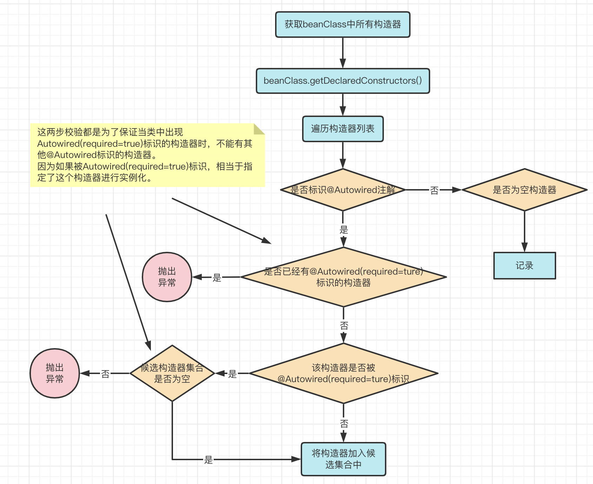
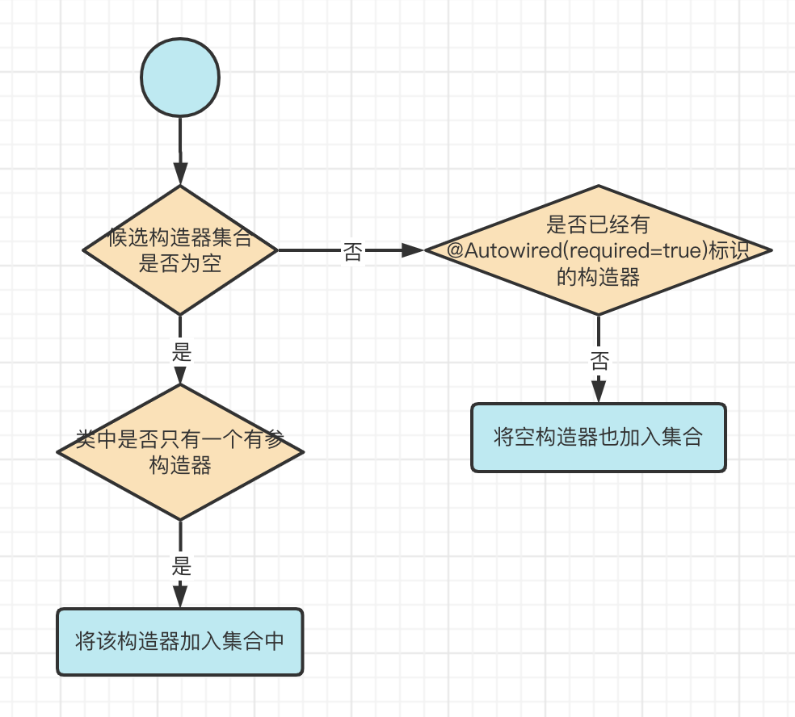

# 为什么面试官总喜欢问Bean生命周期

## 前言

俗话说：金三银四，到了这种季节，有一种叫做程序员的生物就开始活跃了起来。

这俩天，同事出去面试，她回来就问我：为啥这些面试官老爱问Spring，特别是Bean的生命周期，敖丙，到底啥是Bean的生命周期，跟我说说呗。

那咱就来聊聊，本文主要分为两点进行阐述：

1、什么是Bean的生命周期？

2、Bean的生命周期是怎样的？

## 什么是Bean的生命周期

我们知道，在Java中，万物皆对象，这些对象有生命周期：实例化 -> gc回收

而Bean同样也是Java中的对象，只是在这同时，Spring又赋予了它更多的意义。

于是乎，我们将Bean从在Spring中创建开始，到Bean被销毁结束，这一过程称之为Bean的生命周期

那到底Bean在Spring中的创建过程是怎样的呢？

## Bean的生命周期是怎样的

在Spring中，Bean的创建过程看起来复杂，但实际上逻辑分明。

如果我们将所有**扩展性**流程抛开，你会发现只剩下两个流程：对象的实例化和属性填充

我们在《深入浅出Spring架构设计》文中手写的Spring，也只是完成了这两个流程，这足以说明只需要这两个流程就能完成一个简单的Spring框架，那其他的流程又是什么呢？他们又有什么作用？

那么我们现在就基于这两个核心流程出发，尝试完善整个Spring的Bean生命周期。

### 推导过程

开始时，我们只有两个流程：对象的实例化和属性填充


我们知道，对象的实例化就是在Java里使用类构造器进行创建对象。而一个类中可能有很多的构造器，那么我们怎么才能知道使用哪个构造器进行实例化对象呢？

所以说，在实例化之前，还得先做一件事情：确定候选的构造器，也称之为构造器推断

### 构造器推断

功能描述：找寻beanClass中所有符合候选条件的构造器。

负责角色：AutowiredAnnotationBeanPostProcessor

候选条件：构造器上添加了@Autowired注解

推断流程：

1、获取beanClass中的所有构造器进行遍历，判断构造器上是否标识@Autowired注解，是则将构造器添加到候选构造器集合中

2、并进一步判断Autowired注解中required属性是否为true(默认为true)，是则表示该beanClass已存在指定实例化的构造器，不可再有其他加了@Autowired注解的构造器，如果有则抛出异常。

3、如果Autowired注解中required属性为false，则可继续添加其他@Autowired(required=false)标识的构造器

4、如果候选构造器集合不为空(有Autowired标识的构造器)，并且beanClass中还有个空构造器，那么同样将空构造器也加入候选构造器集合中。

5、如果候选构造器集合为空，但是beanClass中只有一个构造器且该构造器有参，那么将该构造器加入候选构造器集合中。

流程图：



当构造器遍历完毕之后，还有些许逻辑




以上判断条件很多，但始终是围绕这一个逻辑：这个beanClass中有没有被`Autowired`标识的构造器，有的话required是true还是false，如果是true, 那其他的构造器都不要了。如果是false，那想加多少个构造器就加多少个。

咦，那要是没有`Autowired`标识的构造器呢？

框架嘛，都是要兜底的，这里就是看beanClass中是不是只有一个构造器且是有参的。

那我要是只有个无参的构造器呢？

那确实就是没有候选的构造器了，但是Spring最后又兜底了一次，在没有候选构造器时默认使用无参构造器

那我要是有很多个构造器呢？

Spring表示那我也不知道用哪个呀，同样进入兜底策略：使用无参构造器

以上便是构造器推断流程。

脑图

在得到候选的构造器之后，就可以对对象进行实例化了，那么实例化的过程是怎样的呢？

### 对象实例化


关于对象实例化，这里很容易引发一个误区：Spring会依据容器中是否有构造器参数的Bean，从而决定构造器的优先级。

比如以下类具有两个构造器

```java
@Component
public class InstanceA {

	@Autowired(required = false)
	public InstanceA(InstanceB instanceB, InstanceD InstanceD){
		System.out.println("instance D ...");
	}

	@Autowired(required = false)
	public InstanceA(InstanceC instanceC){
		System.out.println("instance C ...");
	}

}
```

假设现在容器中只有instanceC，那很容易就会产生这样的错觉：既然instanceB和instanceD没有，那使用第一个构造器初始化不就报错了吗？所以应该使用只有instanceC的构造器呀。

但实际上构造器推断与此完全无关，单纯的是从是否表示标识@Autowired注解，参数多寡来决定优先级。

推断流程：


我们在《深入浅出Spring架构设计》文中提到：在Bean的创建过程中，一共调用了9次BeanPostProcessor，小伙伴可以数数，看看是不是9次呢


