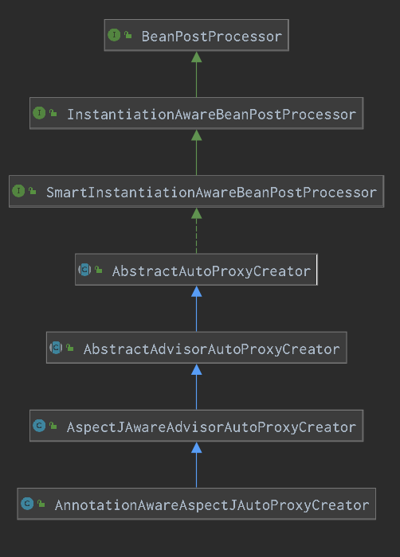

# Spring源码分析之AOP从解析到调用

往期文章：

1. [Spring源码分析之预启动流程](https://mp.weixin.qq.com/s?__biz=MzA4ODI0MTIxOA==&mid=2257483769&idx=1&sn=9ba6435401f9a96c8bf7ae65894ab2a5&scene=21#wechat_redirect)
2. [Spring源码分析之BeanFactory体系结构](https://mp.weixin.qq.com/s?__biz=MzA4ODI0MTIxOA==&mid=2257483975&idx=1&sn=11ac013f8b67b665e68ba923e8423d2d&scene=21#wechat_redirect)
3. [Spring源码分析之BeanFactoryPostProcessor调用过程详解](https://mp.weixin.qq.com/s?__biz=MzA4ODI0MTIxOA==&mid=2257484189&idx=1&sn=2117d0151f9de4e48ff201ad8de27a23&scene=21#wechat_redirect)
4. [Spring源码分析之Bean的创建过程详解](https://mp.weixin.qq.com/s?__biz=MzA4ODI0MTIxOA==&mid=2257484591&idx=1&sn=ce92f4f1cf538d754c19708d7e7ae173&scene=21#wechat_redirect)
5. [Spring源码分析之循环依赖及解决方案](https://mp.weixin.qq.com/s/W2knn8nsyhq0gAgJU5Zhcg)

正文：

在上一篇，我们对IOC核心部分流程已经分析完毕，相信小伙伴们有所收获，从这一篇开始，我们将会踏上新的旅程，即Spring的另一核心：AOP!

首先，为了让大家能更有效的理解AOP，先带大家过一下AOP中的术语：

- **切面（Aspect)**：指关注点模块化，这个关注点可能会横切多个对象。事务管理是企业级Java应用中有关横切关注点的例子。在Spring AOP中，切面可以使用在普通类中以＠Aspect注解来实现。 
- **连接点（Join point)**：在Spring AOP中，一个连接点总是代表一个方法的执行，其实就代表增强的方法。 
- **通知（Advice)**：在切面的某个特定的连接点上执行的动作。通知有多种类型，包括`around`， `before`和`after`等等。许多AOP框架，包括Spring在内，都是以拦截器做通知模型的，并维护着一个以连接点为中心的拦截器链。 
- **目标对象（Target**)：目标对象指将要被增强的对象。即包含主业务逻辑的类的对象。
-  **切点（Pointcut)**：匹配连接点的断言。通知和切点表达式相关联，并在满足这个切点的连接点上运行（例如，当执行某个特定名称的方法时）。切点表达式如何和连接点匹配是AOP的核心：Spring默认使用AspectJ切点语义。 
- **顾问（Advisor)**： 顾问是Advice的一种包装体现，Advisor是Pointcut以及Advice的一个结合，用来管理Advice和Pointcut。
- **织入（Weaving)**：将通知切入连接点的过程叫织入
- **引入（Introductions)**：可以将其他接口和实现动态引入到targetClass中

## 一个栗子

术语看完了，我们先上个Demo回顾一下吧～

1. 首先，使用`EnableAspectJAutoProxy`注解开启我们的AOP

   ```java
   @ComponentScan(basePackages = {"com.my.spring.test.aop"})
   @Configuration
   @EnableAspectJAutoProxy
   public class Main {
   
   	public static void main(String[] args) {
   		AnnotationConfigApplicationContext context = new AnnotationConfigApplicationContext(Main.class);
   		IService service = context.getBean("service", IService.class);
   		service.doService();
   	}
   }
   ```

2. 写一个接口

   ```java
   public interface IService {
   
   	void doService();
   }
   ```

3. 写一个实现类

   ```java
   @Service("service")
   public class ServiceImpl implements IService{
   
   	@Override
   	public void doService() {
   		System.out.println("do service ...");
   	}
   }
   ```

4. 写一个切面

   ```java
   @Aspect
   @Component
   public class ServiceAspect {
   
   	@Pointcut(value = "execution(* com.my.spring.test.aop.*.*(..))")
   	public void pointCut() {
   	}
   
   	@Before(value = "pointCut()")
   	public void methodBefore(JoinPoint joinPoint) {
   		String methodName = joinPoint.getSignature().getName();
   		System.out.println("执行目标方法 【" + methodName + "】 的【前置通知】，入参：" + Arrays.toString(joinPoint.getArgs()));
   	}
   
   	@After(value = "pointCut()")
   	public void methodAfter(JoinPoint joinPoint) {
   		String methodName = joinPoint.getSignature().getName();
   		System.out.println("执行目标方法 【" + methodName + "】 的【后置通知】，入参：" + Arrays.toString(joinPoint.getArgs()));
   	}
   
   	@AfterReturning(value = "pointCut()")
   	public void methodReturn(JoinPoint joinPoint) {
   		String methodName = joinPoint.getSignature().getName();
   		System.out.println("执行目标方法 【" + methodName + "】 的【返回通知】，入参：" + Arrays.toString(joinPoint.getArgs()));
   	}
   
   	@AfterThrowing(value = "pointCut()")
   	public void methodThrow(JoinPoint joinPoint) {
   		String methodName = joinPoint.getSignature().getName();
   		System.out.println("执行目标方法 【" + methodName + "】 的【异常通知】，入参：" + Arrays.toString(joinPoint.getArgs()));
   	}
   }
   ```

5. 测试运行

   ```
   执行目标方法 【doService】 的【前置通知】，入参：[]
   do service ...
   执行目标方法 【doService】 的【返回通知】，入参：[]
   执行目标方法 【doService】 的【后置通知】，入参：[]
   ```

> 以上

Demo看完了，运行效果也出来了，AOP已生效，但如何生效的呢？相比于我们普通使用Bean的Demo，在这里，我们只不过加上了一个`@EnableAspectJAutoProxy`注解以及一个标识了`@Aspectj`的类，那么我们先看看`@EnableAspectJAutoProxy`这个注解做了什么吧～

## 开启AOP

以下是笔者所画的大致流程图


​	其中`AspectJAutoProxyRegistrar`实现了`ImportBeanDefinitionRegistrar`，所以在处理`BeanFactoryPostProcessor`逻辑时将会调用`registerBeanDefinitions`方法，此时就会把`AnnotationAwareAspectJAutoProxyCreator`注册到容器中，其中`BeanFactoryPostProcessor`的逻辑就不再说了，往期文章有过详细分析。而`AnnotationAwareAspectJAutoProxyCreator`的类图如下：



我们发现`AnnotationAwareAspectJAutoProxyCreator`是实现了`BeanPostProcessor`接口的类，所以它其实是一个后置处理器，那么，还记得在创建Bean过程中的`BeanPostProcessor`九次调用时机吗？不记得也没关系，`AnnotationAwareAspectJAutoProxyCreator`起作用的地方是在bean的实例化前以及初始化后，分别对应着解析切面和创建动态代理的过程，现在，就让我们先来看看解析切面的过程吧～

## 解析切面

解析切面的流程如下图所示：


我们已经了解到切面解析的过程是由`AnnotationAwareAspectJAutoProxyCreator`完成的，而`AnnotationAwareAspectJAutoProxyCreator`又继承了`AbstractAutoProxyCreator`，所以首先，我们先会来到`AbstractAutoProxyCreator#postProcessBeforeInstantiation`

```java
public Object postProcessBeforeInstantiation(Class<?> beanClass, String beanName) {
	// class类型是否为(Advice, Pointcut, Advisor, AopInfrastructureBean)
  // shouldSkip中将会解析切面
  if (isInfrastructureClass(beanClass) || shouldSkip(beanClass, beanName)) {
    this.advisedBeans.put(cacheKey, Boolean.FALSE);
    return null;
  }
}
```

调用到子类的`AspectJAwareAdvisorAutoProxyCreator#shouldSkip`

```java
@Override
protected boolean shouldSkip(Class<?> beanClass, String beanName) {
  // 寻找advisor
  List<Advisor> candidateAdvisors = findCandidateAdvisors();
  for (Advisor advisor : candidateAdvisors) {
    if (advisor instanceof AspectJPointcutAdvisor &&
        ((AspectJPointcutAdvisor) advisor).getAspectName().equals(beanName)) {
      return true;
    }
  }
  return super.shouldSkip(beanClass, beanName);
}
```

findCandidateAdvisors

```java
protected List<Advisor> findCandidateAdvisors() {
  // 寻找实现了Advisor接口的类, 由于我们一般不会以接口的方式实现切面，这里返回null
  List<Advisor> advisors = super.findCandidateAdvisors();
  if (this.aspectJAdvisorsBuilder != null) {
    // 这里将解析出所有的切面
    advisors.addAll(this.aspectJAdvisorsBuilder.buildAspectJAdvisors());
  }
  return advisors;
}
```

buildAspectJAdvisors

```java
public List<Advisor> buildAspectJAdvisors() {
  // aspectBeanNames有值则说明切面已解析完毕
  List<String> aspectNames = this.aspectBeanNames;
  // Double Check
  if (aspectNames == null) {
    synchronized (this) {
      aspectNames = this.aspectBeanNames;
      if (aspectNames == null) {
        List<Advisor> advisors = new ArrayList<>();
        aspectNames = new ArrayList<>();
        // 取出是Object子类的bean，其实就是所有的bean
        String[] beanNames = BeanFactoryUtils.beanNamesForTypeIncludingAncestors(
          this.beanFactory, Object.class, true, false);
        for (String beanName : beanNames) {
          // 获得该bean的class
          Class<?> beanType = this.beanFactory.getType(beanName);
          // 判断是否有标识@AspectJ注解
          if (this.advisorFactory.isAspect(beanType)) {
            // 将beanName放入集合中
            aspectNames.add(beanName);
            // 将beanType和beanName封装到AspectMetadata中
            AspectMetadata amd = new AspectMetadata(beanType, beanName);
            // Kind默认为SINGLETON
            if (amd.getAjType().getPerClause().getKind() == PerClauseKind.SINGLETON) {
              MetadataAwareAspectInstanceFactory factory =
                new BeanFactoryAspectInstanceFactory(this.beanFactory, beanName);
              // 这里会通过@Before @After等标识的方法获取到所有的advisor
              List<Advisor> classAdvisors = this.advisorFactory.getAdvisors(factory);
              if (this.beanFactory.isSingleton(beanName)) {
                // 将获取到的所有advisor放入缓存
                this.advisorsCache.put(beanName, classAdvisors);
              }
              advisors.addAll(classAdvisors);
            }
          }
        }
        // 将所有解析过的beanName赋值
        this.aspectBeanNames = aspectNames;
        return advisors;
      }
    }
  }
  // aspectNames不为空，意味有advisor，取出之前解析好的所有advisor
  List<Advisor> advisors = new ArrayList<>();
  // 获取到所有解析好的advisor
  for (String aspectName : aspectNames) {
    List<Advisor> cachedAdvisors = this.advisorsCache.get(aspectName);
    if (cachedAdvisors != null) {
      advisors.addAll(cachedAdvisors);
    }
		return advisors;
	}
```

advisorFactory.getAdvisors

```java
public List<Advisor> getAdvisors(MetadataAwareAspectInstanceFactory aspectInstanceFactory) {
	// 获取到标识了@AspectJ的class，其实就是刚刚封装的class
  Class<?> aspectClass = aspectInstanceFactory.getAspectMetadata().getAspectClass();
  // 获取className
  String aspectName = aspectInstanceFactory.getAspectMetadata().getAspectName();
  
  List<Advisor> advisors = new ArrayList<>();
  
  // 拿出该类除了标识@PointCut的所有方法进行遍历 getAdvisorMethods时会对method进行一次排序
  // 排序顺序 Around, Before, After, AfterReturning, AfterThrowing
  for (Method method : getAdvisorMethods(aspectClass)) {
    // 获取到advisor
    Advisor advisor = getAdvisor(method, lazySingletonAspectInstanceFactory, 0, aspectName);
    if (advisor != null) {
      // 加入到集合中
      advisors.add(advisor);
    }
  }
}
```

我们先看下`getAdvisorMethods`方法

```java
private List<Method> getAdvisorMethods(Class<?> aspectClass) {
  final List<Method> methods = new ArrayList<>();
  // 循环遍历该类和父类的所有方法
  ReflectionUtils.doWithMethods(aspectClass, method -> {
    // 排除@PointCut标识的方法
    if (AnnotationUtils.getAnnotation(method, Pointcut.class) == null) {
      methods.add(method);
    }
  }, ReflectionUtils.USER_DECLARED_METHODS);
  if (methods.size() > 1) {
    // 以Around, Before, After, AfterReturning, AfterThrowing的顺序自定义排序
    methods.sort(METHOD_COMPARATOR);
  }
  return methods;
}
```

> 不知道小伙伴们对ReflectionUtils.doWithMethods这个工具类熟不熟悉呢，这个工具类在之前分析Bean创建过程时可是出现了好多次呢，并且我们也是可以使用的

现在，已经获取到切面中的所有方法了，那么接下来就该对这些方法解析并进行封装成advisor了～

getAdvisor

```java
public Advisor getAdvisor(Method candidateAdviceMethod, MetadataAwareAspectInstanceFactory aspectInstanceFactory,
			int declarationOrderInAspect, String aspectName) {
	// 获取方法上的切点表达式
  AspectJExpressionPointcut expressionPointcut = getPointcut(
    candidateAdviceMethod, aspectInstanceFactory.getAspectMetadata().getAspectClass());
  // 封装成对象返回，创建对象时将会解析方法创建advice
  return new InstantiationModelAwarePointcutAdvisorImpl(expressionPointcut, candidateAdviceMethod,
                                                        this, aspectInstanceFactory, declarationOrderInAspect, aspectName);
}
```

获取切点表达式的过程其实非常简单，即是解析方法上的注解，取出注解上的value即可

getPointcut

```java
private AspectJExpressionPointcut getPointcut(Method candidateAdviceMethod, Class<?> candidateAspectClass) {
  // 查找方法上和AspectJ相关注解
  AspectJAnnotation<?> aspectJAnnotation =
    AbstractAspectJAdvisorFactory.findAspectJAnnotationOnMethod(candidateAdviceMethod);
  // 设置切点表达式
  AspectJExpressionPointcut ajexp =
    new AspectJExpressionPointcut(candidateAspectClass, new String[0], new Class<?>[0]);
  // PointcutExpression 为注解上value属性的值
  ajexp.setExpression(aspectJAnnotation.getPointcutExpression());
  if (this.beanFactory != null) {
    ajexp.setBeanFactory(this.beanFactory);
  }
  return ajexp;
}
```

new InstantiationModelAwarePointcutAdvisorImpl，在这里，才会真正创建出advice

```java
public InstantiationModelAwarePointcutAdvisorImpl(){
  //...省略赋值过程...
  // 实例化出advice
  this.instantiatedAdvice = instantiateAdvice(this.declaredPointcut);
}
```

```java
private Advice instantiateAdvice(AspectJExpressionPointcut pointcut) {
  // 获取advice,aspectJAdviceMethod为方法，aspectName为切面类
  Advice advice = this.aspectJAdvisorFactory.getAdvice(this.aspectJAdviceMethod, pointcut,
                                                       this.aspectInstanceFactory, this.declarationOrder, this.aspectName);
  return (advice != null ? advice : EMPTY_ADVICE);
}
```

```java
public Advice getAdvice(){
  // 根据方法获取到注解信息
  AspectJAnnotation<?> aspectJAnnotation =
				AbstractAspectJAdvisorFactory.findAspectJAnnotationOnMethod(candidateAdviceMethod);
  AbstractAspectJAdvice springAdvice;
  // 根据注解类型返回对象，创建对象的过程都是一样的，都是调用父类的构造方法
  // candidateAdviceMethod为切面的方法，expressionPointcut是切点
  switch (aspectJAnnotation.getAnnotationType()) {
    case AtPointcut
      return null;
    case AtAround:
      springAdvice = new AspectJAroundAdvice(
        candidateAdviceMethod, expressionPointcut, aspectInstanceFactory);
      break;
    case AtBefore:
      springAdvice = new AspectJMethodBeforeAdvice(
        candidateAdviceMethod, expressionPointcut, aspectInstanceFactory);
      break;
    case AtAfter:
      springAdvice = new AspectJAfterAdvice(
        candidateAdviceMethod, expressionPointcut, aspectInstanceFactory);
      break;
      //...省略其他的advice
    default:
      throw new UnsupportedOperationException(
        "Unsupported advice type on method: " + candidateAdviceMethod);
  }
  return springAdvice;
}
```

> springAdvice已创建完毕，意味着切面中的某个方法已经解析完毕了，其他的方法解析过程大致也是相似的

### 小结

其实解析切面本身并不复杂，只是Spring中将切面类封装来封装去容易使人混乱，如`buildAspectJAdvisors`方法中，封装了一个`AspectMetadata amd = new AspectMetadata(beanType, beanName);`，又立即发起判定`amd.getAjType().getPerClause().getKind() == PerClauseKind.SINGLETON`，其实这里完全可以变为`AjTypeSystem.getAjType(currClass).getPerClause().getKind() == PerClauseKind.SINGLETON`，`AjTypeSystem.getAjType(currClass)`为`new AspectMetadata`的一部分逻辑，笔者这里给大家总结一下吧。

首先，循环所有的beanName，找到带有@Aspectj注解的class, 获取到class中的所有方法进行遍历解析，取出方法注解上的值（切点：pointcut），然后把方法，切点表达式，封装了BeanFactory,BeanName的factory封装成相应的SpringAdvice, 由SpringAdvice和pointcut组合成一个advisor。

## 创建代理对象

切面已经解析完毕，接下来，我们就来看看如何把解析出的切面织入到目标方法中吧

但，在这之前，还有必要给小伙伴们补充一点前置知识。

我们知道，一个bean是否能够被aop代理，取决于它是否满足代理条件，即为是否能够被切点表达式所命中，而在Spring AOP中，bean与切点表达式进行匹配的是AspectJ实现的，并非Spring所完成的，所以我们先来看看AspectJ如何匹配出合适的bean的吧

### 栗子

首先需要引入`org.aspectj:aspectjweaver`依赖

一个Service，包名为`com.my.spring.test.aop`

```java
package com.my.spring.test.aop;

/**
 * 切点表达式可以匹配的类
 *
 */
public class ServiceImpl{
	/**
	 * 切点表达式可以匹配的方法
	 */
  public void doService() {
    System.out.println("do service ...");
  }
	public void matchMethod() {
		System.out.println("ServiceImpl.notMatchMethod");
	}
}
```

然后，我们自己封装一个用于匹配的工具类，具体功能大家看注释哈哈

```java
package com.my.spring.test.aspectj;

import org.aspectj.weaver.tools.PointcutExpression;
import org.aspectj.weaver.tools.PointcutParser;
import org.aspectj.weaver.tools.ShadowMatch;

import java.lang.reflect.Method;

/**
 * aop工具
 */
public class AOPUtils {
	// AspectJ的固定写法，获取一个切点解析器
	static PointcutParser parser = PointcutParser
			.getPointcutParserSupportingSpecifiedPrimitivesAndUsingSpecifiedClassLoaderForResolution(
					PointcutParser.getAllSupportedPointcutPrimitives(), ClassLoader.getSystemClassLoader());
	// 切点表达式
	private static PointcutExpression pointcutExpression;

	/**
	 * 初始化工具类，我们需要先获取一个切点表达式
	 *
	 * @param expression 表达式
	 */
	public static void init(String expression){
		// 解析出一个切点表达式
		pointcutExpression =  parser.parsePointcutExpression(expression);
	}

	/**
	 * 第一次筛选，根据类筛选，也叫做粗筛
	 *
	 * @param targetClass 目标类
	 * @return 是否匹配
	 */
	public static boolean firstMatch(Class<?> targetClass){
    // 根据类筛选
		return pointcutExpression.couldMatchJoinPointsInType(targetClass);
	}

	/**
	 * 第二次筛选，根据方法筛选，也叫做精筛，精筛通过则说明完全匹配
	 * ps: 也可以使用该方法进行精筛，粗筛的目的是提高性能，第一次直接过滤掉不合适的类再慢慢精筛
	 * 
	 * @param method 方法
	 * @return 是否匹配
	 */
	public static boolean lastMatch(Method method){
    // 根据方法筛选
		ShadowMatch shadowMatch = pointcutExpression.matchesMethodExecution(method);
		return shadowMatch.alwaysMatches();
	}

}
```

测试

```java
public class AOPUtilsTest {

	public static void main(String[] args) throws NoSuchMethodException {
		// 定义表达式
		String expression = "execution(* com.my.spring.test.aop.*.*(..))";
		// 初始化工具类
		AOPUtils.init(expression);
		// 粗筛
		boolean firstMatch = AOPUtils.firstMatch(ServiceImpl.class);
		if(firstMatch){
			System.out.println("第一次筛选通过");
			// 正常情况应该是获取所有方法进行遍历，我这里偷懒了～
			Method doService = ServiceImpl.class.getDeclaredMethod("doService");
			// 精筛
			boolean lastMatch = AOPUtils.lastMatch(doService);
			if(lastMatch){
				System.out.println("第二次筛选通过");
			}
			else{
				System.out.println("第二次筛选未通过");
			}
		}
		else {
			System.out.println("第一次筛选未通过");
		}
	}
}
```

结果(就不截图了，怀疑的小伙伴可以自己试试～)

```java
第一次筛选通过
第二次筛选通过
```

当我们新建一个类`Test`,把切点表达式换成

```java
execution(* com.my.spring.test.aop.Test.*(..))
```

测试结果为

```
第一次筛选未通过
```

再把切点表达式换成指定的方法

```
execution(* com.my.spring.test.aop.*.matchMethod(..))
```

结果

```
第一次筛选通过
第二次筛选未通过
```

> 到这里，小伙伴们应该明白了AspectJ的使用方法吧

### 代理对象创建过程

接下来，我们就来看看Spring是如何使用AspectJ匹配出相应的advisor并创建代理对象的吧，以下为创建代理对象的大致路程图


创建代理对象是在bean初始化后完成的，所以对应的`beanPostProcessor`调用时机为`postProcessAfterInitialization`

AbstractAutoProxyCreator#postProcessAfterInitialization

```java
public Object postProcessAfterInitialization(@Nullable Object bean, String beanName) {
		if (bean != null) {
			// 获取缓存key值，其实就是beanName
			Object cacheKey = getCacheKey(bean.getClass(), beanName);
			// 判断缓存中是否有该对象，有则说明该对象已被动态代理，跳过
			if (this.earlyProxyReferences.remove(cacheKey) != bean) {
				return wrapIfNecessary(bean, beanName, cacheKey);
			}
		}
		return bean;
	}
```

wrapIfNecessary

```java
protected Object wrapIfNecessary(Object bean, String beanName, Object cacheKey) {
	// 根据bean获取到匹配的advisor
  Object[] specificInterceptors = getAdvicesAndAdvisorsForBean(bean.getClass(), beanName, null);
  if (specificInterceptors != DO_NOT_PROXY) {
    // 创建代理对象
    Object proxy = createProxy(
      bean.getClass(), beanName, specificInterceptors, new SingletonTargetSource(bean));
    return proxy;
  }
  return bean;
}
```

getAdvicesAndAdvisorsForBean

```java
protected Object[] getAdvicesAndAdvisorsForBean(
			Class<?> beanClass, String beanName, @Nullable TargetSource targetSource) {
  // 获取合适的advisor
  List<Advisor> advisors = findEligibleAdvisors(beanClass, beanName);
  return advisors.toArray();
}
```

findEligibleAdvisors

```java
protected List<Advisor> findEligibleAdvisors(Class<?> beanClass, String beanName) {
  // 先获取到所有的advisor, 这里和解析过程相同，由于已经解析好，所以会直接从缓存中取出
  List<Advisor> candidateAdvisors = findCandidateAdvisors();
  // 筛选出匹配的advisor
  List<Advisor> eligibleAdvisors = findAdvisorsThatCanApply(candidateAdvisors, beanClass, beanName);
  // 增加一个默认的advisor
  extendAdvisors(eligibleAdvisors);
  if (!eligibleAdvisors.isEmpty()) {
    // 排序
    eligibleAdvisors = sortAdvisors(eligibleAdvisors);
  }
  return eligibleAdvisors;
}
```

findAdvisorsThatCanApply

```java
protected List<Advisor> findAdvisorsThatCanApply(
			List<Advisor> candidateAdvisors, Class<?> beanClass, String beanName) {
  // 查找匹配的advisor
  return AopUtils.findAdvisorsThatCanApply(candidateAdvisors, beanClass);
}
```

findAdvisorsThatCanApply

```java
public static List<Advisor> findAdvisorsThatCanApply(List<Advisor> candidateAdvisors, Class<?> clazz){
  List<Advisor> eligibleAdvisors = new ArrayList<>();
  for (Advisor candidate : candidateAdvisors) {
    // 判断是否匹配
    if (canApply(candidate, clazz, hasIntroductions)) {
      // 加入到合适的advisors集合中
      eligibleAdvisors.add(candidate);
    }
  }
  return eligibleAdvisors;
}
```

canApply

```java
public static boolean canApply(Advisor advisor, Class<?> targetClass, boolean hasIntroductions) {
  if (advisor instanceof PointcutAdvisor) {
    PointcutAdvisor pca = (PointcutAdvisor) advisor;
    // 判断是否匹配
    return canApply(pca.getPointcut(), targetClass, hasIntroductions);
  }
  else {
    // It doesn't have a pointcut so we assume it applies.
    return true;
  }
}
```

canApply

```java
public static boolean canApply(Pointcut pc, Class<?> targetClass, boolean hasIntroductions) {
	// 第一次筛选，对class筛选判断是否满足匹配条件
  // 这里将会初始化切点表达式
  if (!pc.getClassFilter().matches(targetClass)) {
    return false;
  }
  
  IntroductionAwareMethodMatcher introductionAwareMethodMatcher = null;
  if (methodMatcher instanceof IntroductionAwareMethodMatcher) {
    introductionAwareMethodMatcher = (IntroductionAwareMethodMatcher) methodMatcher;
  }
  
  for (Class<?> clazz : classes) {
    Method[] methods = ReflectionUtils.getAllDeclaredMethods(clazz);
    // 循环所有方法进行第二次筛选，判断是否有方法满足匹配条件
    for (Method method : methods) {
      if (introductionAwareMethodMatcher != null ?
          introductionAwareMethodMatcher.matches(method, targetClass, hasIntroductions) :
          methodMatcher.matches(method, targetClass)) {
        return true;
      }
    }
  }
  return false;
}
```

pc.getClassFilter()

```java
public ClassFilter getClassFilter() {
  obtainPointcutExpression();
  return this;
}
```

obtainPointcutExpression

```java
private PointcutExpression obtainPointcutExpression() {
  if (this.pointcutExpression == null) {
    // 确认类加载器
    this.pointcutClassLoader = determinePointcutClassLoader();
    // 创建切点表达式
    this.pointcutExpression = buildPointcutExpression(this.pointcutClassLoader);
  }
  return this.pointcutExpression;
}
```

buildPointcutExpression

```java
private PointcutExpression buildPointcutExpression(@Nullable ClassLoader classLoader) {
  // 初始化切点解析器
  PointcutParser parser = initializePointcutParser(classLoader);
  PointcutParameter[] pointcutParameters = new PointcutParameter[this.pointcutParameterNames.length];
  for (int i = 0; i < pointcutParameters.length; i++) {
    pointcutParameters[i] = parser.createPointcutParameter(
      this.pointcutParameterNames[i], this.pointcutParameterTypes[i]);
  }
  // 使用切点解析器进行解析表达式获取切点表达式
  return parser.parsePointcutExpression(replaceBooleanOperators(resolveExpression()),
                                        this.pointcutDeclarationScope, pointcutParameters);
}
```

initializePointcutParser

```java
private PointcutParser initializePointcutParser(@Nullable ClassLoader classLoader) {
  // 获得切点解析器
  PointcutParser parser = PointcutParser
    .getPointcutParserSupportingSpecifiedPrimitivesAndUsingSpecifiedClassLoaderForResolution(
    SUPPORTED_PRIMITIVES, classLoader);
  parser.registerPointcutDesignatorHandler(new BeanPointcutDesignatorHandler());
  return parser;
}
```

> pc.getClassFilter便是完成了以上事情，此时再进行调用matchs方法

```java
public boolean matches(Class<?> targetClass) {
  PointcutExpression pointcutExpression = obtainPointcutExpression();
  // 使用切点表达式进行粗筛
  return pointcutExpression.couldMatchJoinPointsInType(targetClass);
}
```

> introductionAwareMethodMatcher.matches 同样如此
>
> 以上便是寻找合适的advisor的过程，下面，就是通过这些advisor进行创建动态代理了

createProxy

```java
protected Object createProxy(Class<?> beanClass, @Nullable String beanName,
			@Nullable Object[] specificInterceptors, TargetSource targetSource) {
  ProxyFactory proxyFactory = new ProxyFactory();
  proxyFactory.copyFrom(this);
	// 将specificInterceptors（现在是Object）转化为Advisor返回
  Advisor[] advisors = buildAdvisors(beanName, specificInterceptors);
  // 赋值到proxyFactory的advisors属性中
  proxyFactory.addAdvisors(advisors);
  proxyFactory.setTargetSource(targetSource);
  customizeProxyFactory(proxyFactory);
  // 创建动态代理
  return proxyFactory.getProxy(getProxyClassLoader());
}
```

proxyFactory.getProxy

```java
public Object getProxy(@Nullable ClassLoader classLoader) {
  // 创建代理对象
  return createAopProxy().getProxy(classLoader);
}
```

createAopProxy

```java
protected final synchronized AopProxy createAopProxy() {
  // 创建AOP代理对象
  return getAopProxyFactory().createAopProxy(this);
}
```

```java
public AopProxy createAopProxy(AdvisedSupport config) throws AopConfigException {
  // @EnableAspectJAutoProxy的proxyTargetClass是否配置为true
  if (config.isOptimize() || config.isProxyTargetClass() || hasNoUserSuppliedProxyInterfaces(config)) {
    Class<?> targetClass = config.getTargetClass();
    if (targetClass == null) {
      throw new AopConfigException("TargetSource cannot determine target class: " +
                                   "Either an interface or a target is required for proxy creation.");
    }
    // 如何是接口则创建jdk动态代理
    if (targetClass.isInterface() || Proxy.isProxyClass(targetClass)) {
      return new JdkDynamicAopProxy(config);
    }
    // cglib动态代理
    return new ObjenesisCglibAopProxy(config);
  }
  // 默认是jdk动态代理
  else {
    return new JdkDynamicAopProxy(config);
  }
}
```

```java
public Object getProxy(@Nullable ClassLoader classLoader) {
  // 获取到代理的接口
  Class<?>[] proxiedInterfaces = AopProxyUtils.completeProxiedInterfaces(this.advised, true);
  findDefinedEqualsAndHashCodeMethods(proxiedInterfaces);
  // 创建jdk代理，传入的为JdkDynamicAopProxy对象，里面包含了被代理的bean以及匹配的advisor
  return Proxy.newProxyInstance(classLoader, proxiedInterfaces, this);
}
```

> 动态代理创建完成～

## 代理对象调用过程

对象都给你创建好了，接下当然是开..发起调用咯

以下是调用的大致流程图


代理对象被调用的是invoke方法，我们所创建的代理对象为`JdkDynamicAopProxy`，所以

JdkDynamicAopProxy#invoke

```java
public Object invoke(Object proxy, Method method, Object[] args) throws Throwable {
  Object oldProxy = null;
  boolean setProxyContext = false;
  // 取出包装了被代理bean的对象->创建代理对象时的SingletonTargetSource, advised为ProxyFactory
  TargetSource targetSource = this.advised.targetSource;
  Object target = null;
  // 拿到bean
  target = targetSource.getTarget();
  Class<?> targetClass = (target != null ? target.getClass() : null);
  // 将所有advisor中的advice取出，并转化为对应的interceptor
  List<Object> chain = this.advised.getInterceptorsAndDynamicInterceptionAdvice(method, targetClass);
  // 创建一个最外层的MethodInvocation用于发起调用
  MethodInvocation invocation =
    new ReflectiveMethodInvocation(proxy, target, method, args, targetClass, chain);
  // 发起链式调用
  Object retVal = invocation.proceed();
  return retVal;
}
```

我们先看获取interceptor的过程

getInterceptorsAndDynamicInterceptionAdvice

```java
public List<Object> getInterceptorsAndDynamicInterceptionAdvice(Method method, @Nullable Class<?> targetClass) {
  // 将所有advisor中的advice取出并封装成intercept
  return this.advisorChainFactory.getInterceptorsAndDynamicInterceptionAdvice(this, method, targetClass);
}
```

```java
public List<Object> getInterceptorsAndDynamicInterceptionAdvice(
  Advised config, Method method, @Nullable Class<?> targetClass) {
	// 创建一个advisor适配器的注册器用于转化advice，创建时将默认注册三个适配器
  AdvisorAdapterRegistry registry = GlobalAdvisorAdapterRegistry.getInstance();
  Advisor[] advisors = config.getAdvisors();
  // 循环遍历所有advisor
  for (Advisor advisor : advisors) {
  	// 将advisor中的advice转化为interceptor
    MethodInterceptor[] interceptors = registry.getInterceptors(advisor);
    interceptorList.addAll(Arrays.asList(interceptors));
    return interceptorList;
  }
}
```

GlobalAdvisorAdapterRegistry.getInstance() 类初始化时调用静态方法

```java
private static AdvisorAdapterRegistry instance = new DefaultAdvisorAdapterRegistry()
public static AdvisorAdapterRegistry getInstance() {
		return instance;
}
```

```java
public DefaultAdvisorAdapterRegistry() {
  // 注册三个适配器
  registerAdvisorAdapter(new MethodBeforeAdviceAdapter());
  registerAdvisorAdapter(new AfterReturningAdviceAdapter());
  registerAdvisorAdapter(new ThrowsAdviceAdapter());
}
```

```java
public void registerAdvisorAdapter(AdvisorAdapter adapter) {
  // 将适配器加入集合
  this.adapters.add(adapter);
}
```

registry.getInterceptors 这里面包含了advice转化成interceptor的过程

```java
public MethodInterceptor[] getInterceptors(Advisor advisor) throws UnknownAdviceTypeException {
  List<MethodInterceptor> interceptors = new ArrayList<>(3);
  Advice advice = advisor.getAdvice();
  // advice本身是否就是MethodInterceptor
  if (advice instanceof MethodInterceptor) {
    interceptors.add((MethodInterceptor) advice);
  }
  for (AdvisorAdapter adapter : this.adapters) {
    // 判断advice是哪个advice 如：(advice instanceof MethodBeforeAdvice)
    if (adapter.supportsAdvice(advice)) {
      // 将advice封装到对应的interceptor
      interceptors.add(adapter.getInterceptor(advisor));
    }
  }
  return interceptors.toArray(new MethodInterceptor[0]);
}
```

若adapter为`MethodBeforeAdviceAdapter`，则

```java
public MethodInterceptor getInterceptor(Advisor advisor) {
  MethodBeforeAdvice advice = (MethodBeforeAdvice) advisor.getAdvice();
  return new MethodBeforeAdviceInterceptor(advice);
}
```

> 其他advice转化过程相同
>
> 以上，便将所有的advice转化成了interceptor，接下来，则是经典的链式递归调用过程

以下过程小伙伴们可以对照流程图阅读，毕竟递归还是有些复杂，需要一定的功底

ReflectiveMethodInvocation#proceed

```java
public Object proceed() throws Throwable {
  // currentInterceptorIndex 初始值为-1
  // 当currentInterceptorIndex等于advice的数量减一时，则调用目标方法
  // 由于advice已排好序，所以调用顺序为before, after, afterReturn, afterThrowing
  // 注意，并非调用到相应的advice就会执行advice方法，这里是类似递归调用的方式，会存在一个归过程
  // 有些是递的时候发起调用，如beforeAdvice, 但有些则是归的时候发起调用，如afterAdvice
  // 递归的终止条件则是这下面这个return invokeJoinpoint();
  if (this.currentInterceptorIndex == this.interceptorsAndDynamicMethodMatchers.size() - 1) {
    return invokeJoinpoint();
  }
	// currentInterceptorIndex自增并获取到interceptor
  Object interceptorOrInterceptionAdvice =
    this.interceptorsAndDynamicMethodMatchers.get(++this.currentInterceptorIndex);
  // 将interceptro强转为MethodInterceptor发起调用
  return ((MethodInterceptor) interceptorOrInterceptionAdvice).invoke(this);
}
```

此时currentInterceptorIndex值为0，而我们的advice为4个(去除了默认的)，所以当currentInterceptorIndex为3时便会调用我们的实际方法

首先调用的是MethodBeforeAdviceInterceptor

```java
public Object invoke(MethodInvocation mi) throws Throwable {
  // 调用前置通知
  this.advice.before(mi.getMethod(), mi.getArguments(), mi.getThis());
  return mi.proceed();
}
```

> mi为传入的this，所有mi.proceed()将会回到最开始的方法

再次循环，此时currentInterceptorIndex值为1

调用的是AspectJAfterAdvice

```java
public Object invoke(MethodInvocation mi) throws Throwable {
  try {
    return mi.proceed();
  }
  finally {
    // finally意味着不管怎样都会被调用
    invokeAdviceMethod(getJoinPointMatch(), null, null);
  }
}
```

继续，此时currentInterceptorIndex值为2

调用的是AfterReturningAdviceInterceptor

```java
public Object invoke(MethodInvocation mi) throws Throwable {
  Object retVal = mi.proceed();
  this.advice.afterReturning(retVal, mi.getMethod(), mi.getArguments(), mi.getThis());
  return retVal;
}
```

继续，此时currentInterceptorIndex值为3

调用的是AspectJAfterThrowingAdvice

```java
public Object invoke(MethodInvocation mi) throws Throwable {
  try {
    return mi.proceed();
  }
  catch (Throwable ex) {
    if (shouldInvokeOnThrowing(ex)) {
      // 调用异常通知
      invokeAdviceMethod(getJoinPointMatch(), null, ex);
    }
    // 往外抛出异常
    throw ex;
  }
}
```

> 所以如果我们的业务方法发生了异常，会调用到异常通知，而这里又把异常往外抛，所以afterReturn就会被跳过直接到after的finally方法

现在currentInterceptorIndex值为3了，再回调最初的方法中时，就会调用到我们的业务方法了。调用完毕则进行归的过程，调用过程便结束了。

> 以上，便是整个AOP的过程了，下一篇，事务相关源码解析～
>
> 本篇文章中涉及到图片的矢量图地址为：https://www.processon.com/view/link/5fa8afdae401fd45d109f257，有需要的小伙伴可自取

