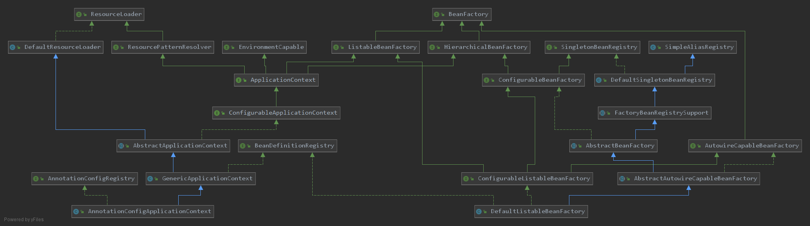
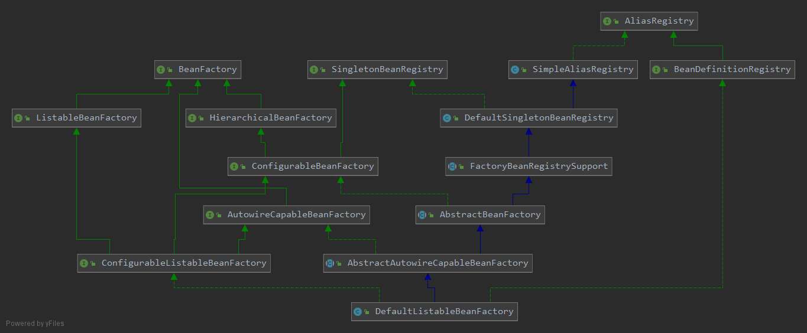
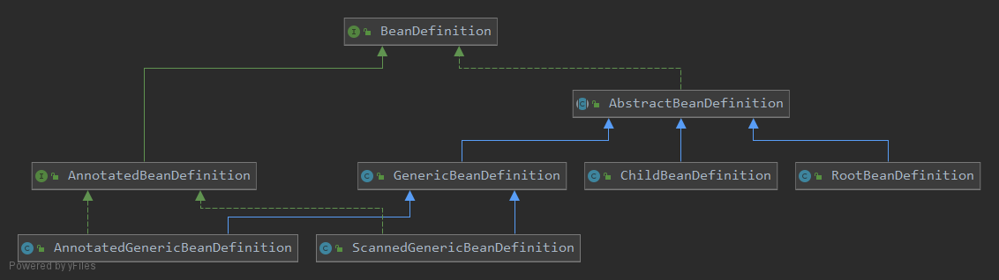
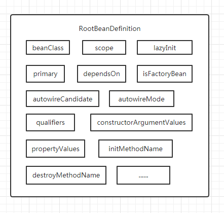
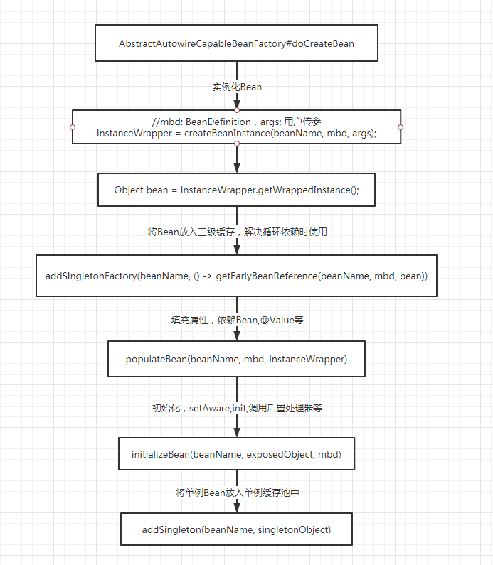

# 什么是BeanFactory？

提到Spring，总是让人第一时间想起IOC容器，而IOC容器的顶层核心接口就是我们的`BeanFactory`，如果能够理解`BeanFactory`的体系结构想必能让我们对Spring整体脉络有更加清晰的认知，所以，本文的探究方向主要为以下几点：

- `BeanFactory`的体系结构是怎样的？
- `Bean`的元信息从何而来？
- `BeanFactory`生产`Bean`的过程是怎样的？

 ## BeanFactory的体系结构

我们先来看看有哪些子类实现了它吧



其中`ApplicationContext`这一块已在上篇文章有详细说明，而`DefaultListableBeanFactory`这个底层实现类便理所当然的成为了我们此次探究的出发点，为了让我们有个更好的观感，以下是纯粹的`BeanFactory`UML图：



我们可以看到`DefaultListableBeanFactory`实现的接口有：

- `SingletonBeanRegistry`: 定义了对单例缓存池相关的操作，如将bean注册到单例缓存池中
- `ConfigurableBeanFactory`: 可配置的`BeanFactory`，定义了各种各样的配置能力，如bean的作用域，bean的classLoader,添加bean的后置处理器，设置bean的创建状态，销毁bean等等
- `AutowireCapableBeanFactory`: 能进行自动装配的`BeanFactory`,这可能是我们最为熟悉的`BeanFactory`，定义了自动装配的类型(byName/byType)，`createBean`, `autowireBean`, 自动装配属性, populateBean, initializeBean, 对于与bean生命周期相关的方法都将在这里体现
- `ListableBeanFactory`: 对`BeanFactory`的增强，定义了一系列根据beanType获取bean或者beanName的方法
- `ConfigurableListableBeanFactory`: 对`ConfigurableBeanFactory`的增强，定义了忽略bean的类型、缓存bean定义、预实例化单例bean等方法
- `BeanDefinitionRegistry`: bean定义注册器，定义了与bean定义相关的方法

如果说以上的接口体现了`DefaultListableBeanFactory`具备的功能，那么它所继承的一系列类就是这些功能的实现：

- `DefaultSingletonBeanRegistry`: 单例bean注册器，定义了三级缓存，其实就是三个Map属性
- `FactoryBeanRegistrySupport`: 提供对`FactoryBean`的支持
- `AbstractBeanFactory`: 实现了一系列操作IOC容器的功能，但最终的createBean依旧交由子类`AbstractAutowireCapableBeanFactory`完成
- `AbstractAutowireCapableBeanFactory`: 实现了创建bean的功能，所有与创建bean的相关的功能都在这里
- `DefaultListableBeanFactory`: 在以上父类的功能基础上实现了`ConfigurableBeanFactory`和`BeanDefinitionRegistry`接口，定义了一些存放Bean定义相关信息的Map

> 看到这里，想必对`DefaultListableBeanFactory`已经有一个大致的了解了，那么问题来啦，我们应该怎么从容器中获取一个bean呢？是不是只要通过`BeanDefinitionRegistry`注册一个bean定义，再通过`AutowireCapableBeanFactory`去createBean就完成了呢？就像下面这样：

```java
DefaultListableBeanFactory beanFactory = new DefaultListableBeanFactory();
RootBeanDefinition beanDefinition = new RootBeanDefinition(Wheel.class);
beanFactory.registerBeanDefinition("wheel",beanDefinition);
beanFactory.getBean("wheel", Wheel.class);
```

## `Bean`的元信息从何而来？

我们现在已经知道`DefaultListableBeanFactory`的大致功能了，我们发现当我们想要创建一个`Bean`的时候，总是离不开一个名词：Bean定义，那么这个Bean定义究竟是什么呢？

`BeanDefinition`其实是一个接口，并不是一个具体的类，我们也可以看一下它的UML图：



可以发现这里使用了模板方法的设计模式扩展了许多的子类，其中我们最常用的为`RootBeanDefinition`，它主要包含的属性如下：



我们向容器中注册的Bean定义的信息大概就是如此，当`BeanFactory`生产`Bean`时，便可以通过`beanClass`清楚的知道`Bean`的类是什么，作用域是怎样，是否懒加载，init方法是什么等等等等

> 咦，如果一个最简单的bean，好像可以直接通过反射就搞定了耶~

具体结构已经清楚了，那我们来看一下注册过程吧

### 先从Demo看起

```java
public static void main(String[] args) {
    //创建一个DefaultListableBeanFactory实例
    DefaultListableBeanFactory beanFactory = new DefaultListableBeanFactory();
    //创建一个BeanDefinition
    RootBeanDefinition beanDefinition = new RootBeanDefinition(Wheel.class);
    //将BeanDefinition注册到容器中
    beanFactory.registerBeanDefinition("wheel",beanDefinition);
}

public static class Wheel {
}
```

### 创建BeanDefinition

```java
public RootBeanDefinition(@Nullable Class<?> beanClass) {
    //初始化父类
    super();
    //将beanClass赋值给this.BeanClass
    setBeanClass(beanClass);
}
```

初始化父类

```java
//将其中一部分属性赋予默认值
autowireCandidate = true;
primary = false;

protected AbstractBeanDefinition() {
    this(null, null);
}
protected AbstractBeanDefinition(@Nullable ConstructorArgumentValues cargs, @Nullable MutablePropertyValues pvs) {
    this.constructorArgumentValues = cargs;
    this.propertyValues = pvs;
}
```

### 将BeanDefinition注册到容器中

```java
//除去校验逻辑，注册时只做了这两步操作
this.beanDefinitionMap.put(beanName, beanDefinition);
this.beanDefinitionNames.add(beanName);
```

看到这里，大家伙可能会充满疑问？what? 就这样？没有填充属性的步骤吗？嘿嘿，`BeanFactory`是一个纯粹的工厂，只负责生产`Bean`，是没有装配（设计）`BeanDefinition`的功能的，专业的事还是交给专业的人做，设计的事情还是交由`ApplicationContext`完成的。

那在`ApplicationContext`中是怎么完成一个`BeanDefinition`的呢？还记得预启动将配置类注册到容器中时有这样一段代码吗？以下代码为`AnnotatedBeanDefinitionReader#doRegisterBean`中的摘要部分：

```java
<T> void doRegisterBean(Class<T> annotatedClass, @Nullable Supplier<T> instanceSupplier, @Nullable String name,
                        @Nullable Class<? extends Annotation>[] qualifiers, BeanDefinitionCustomizer... definitionCustomizers) {
	//.......代码
    //处理普通的bean定义注解，@Lazy @Primary @DependsOn @Role @Description
    AnnotationConfigUtils.processCommonDefinitionAnnotations(abd);
    //......代码
   
} 
```

而非配置的`Bean`是通过在预启动时注册的配置类后置处理器`ConfigurationClassPostProcessor#processConfigBeanDefinitions`中完成的，以下代码为`ClassPathBeanDefinitionScanner#doScan`中的摘要部分，详细调用链将在后面的文章进行说明

```java
//传入我们配置类的包路径
protected Set<BeanDefinitionHolder> doScan(String... basePackages) {
		Set<BeanDefinitionHolder> beanDefinitions = new LinkedHashSet<>();
		for (String basePackage : basePackages) {
            //寻找到所有标识了@Component注解的BeanDefinition
			Set<BeanDefinition> candidates = findCandidateComponents(basePackage);
			for (BeanDefinition candidate : candidates) {
				//....省略代码
				if (candidate instanceof AbstractBeanDefinition) {
                    //处理BeanDefinition
					postProcessBeanDefinition((AbstractBeanDefinition) candidate, beanName);
				}
				if (candidate instanceof AnnotatedBeanDefinition) {
 //处理普通的bean定义注解，@Lazy @Primary @DependsOn @Role @Description
                    AnnotationConfigUtils.processCommonDefinitionAnnotations((AnnotatedBeanDefinition) candidate);
				}
                //...省略代码
                //将BeanDefinition注册到容器中
                registerBeanDefinition(definitionHolder, this.registry);
            }
	}
```

处理BeanDefinition

```java
protected void postProcessBeanDefinition(AbstractBeanDefinition beanDefinition, String beanName) {
	//设置默认值
    beanDefinition.applyDefaults(this.beanDefinitionDefaults);
    //这里默认为空
    if (this.autowireCandidatePatterns != null) {
        beanDefinition.setAutowireCandidate(PatternMatchUtils.simpleMatch(this.autowireCandidatePatterns, beanName));
    }
}
```

设置默认值

```java
public void applyDefaults(BeanDefinitionDefaults defaults) {
    //默认为null
    Boolean lazyInit = defaults.getLazyInit();
    if (lazyInit != null) {
        setLazyInit(lazyInit);
    }
    //默认为0
    setAutowireMode(defaults.getAutowireMode());
    //默认为0
    setDependencyCheck(defaults.getDependencyCheck());
    //默认为null
    setInitMethodName(defaults.getInitMethodName());
    setEnforceInitMethod(false);
    //默认为null
    setDestroyMethodName(defaults.getDestroyMethodName());
    setEnforceDestroyMethod(false);
}
```

处理普通的bean定义注解

```java
public static void processCommonDefinitionAnnotations(AnnotatedBeanDefinition abd) {
    processCommonDefinitionAnnotations(abd, abd.getMetadata());
}

static void processCommonDefinitionAnnotations(AnnotatedBeanDefinition abd, AnnotatedTypeMetadata metadata) {
    	//从元数据中取出该注解的属性列表，不为空说明有标识该注解
		AnnotationAttributes lazy = attributesFor(metadata, Lazy.class);
		if (lazy != null) {
			abd.setLazyInit(lazy.getBoolean("value"));
		}
		else if (abd.getMetadata() != metadata) {
			lazy = attributesFor(abd.getMetadata(), Lazy.class);
			if (lazy != null) {
				abd.setLazyInit(lazy.getBoolean("value"));
			}
		}
		//判断元数据中是否有该注解
		if (metadata.isAnnotated(Primary.class.getName())) {
			abd.setPrimary(true);
		}
		AnnotationAttributes dependsOn = attributesFor(metadata, DependsOn.class);
		if (dependsOn != null) {
			abd.setDependsOn(dependsOn.getStringArray("value"));
		}
		AnnotationAttributes role = attributesFor(metadata, Role.class);
		if (role != null) {
			abd.setRole(role.getNumber("value").intValue());
		}
		AnnotationAttributes description = attributesFor(metadata, Description.class);
		if (description != null) {
			abd.setDescription(description.getString("value"));
		}
	}
```

attributesFor(metadata, Lazy.class)

```java
static AnnotationAttributes attributesFor(AnnotatedTypeMetadata metadata, Class<?> annotationClass) {
    return attributesFor(metadata, annotationClass.getName());
}
static AnnotationAttributes attributesFor(AnnotatedTypeMetadata metadata, String annotationClassName) {
    //metadata为beanClass的注解元数据，存放了该类所配置的所有注解
    //annotationClassName为需要寻找的注解名称
    return AnnotationAttributes.fromMap(metadata.getAnnotationAttributes(annotationClassName, false));
}
default Map<String, Object> getAnnotationAttributes(String annotationName,
                                                    boolean classValuesAsString) {
    //遍历元数据中的所有注解
    MergedAnnotation<Annotation> annotation = getAnnotations().get(annotationName,
                                                                   null, MergedAnnotationSelectors.firstDirectlyDeclared());
    //不存在则返回null,否则返回一个map
    if (!annotation.isPresent()) {
        return null;
    }
    return annotation.asAnnotationAttributes(Adapt.values(classValuesAsString, true));
}
```

> 以上为扫描@Component注解类进行解析元数据填充属性的逻辑，在配置类中以@Bean方式注册的BeanDefinition填充属性过程在ConfigurationClassBeanDefinitionReader.loadBeanDefinitions(configClasses)

## `BeanFactory`生产`Bean`的过程是怎样的？

现在，我们已经知道了一个`BeanDefinition`的具体结构以及是如何产生并注册到`BeanFactory`的，那么`BeanFactory`又是如何使用它生产`Bean`的呢？以下附上`createBean`的粗略流程图，具体细节将放在IOC容器启动流程中详细说明




> 那么关于`BeanFactory`的相关内容就到这里了，希望大家有所收获，下篇将正式进入Spring IOC容器的启动流程！

