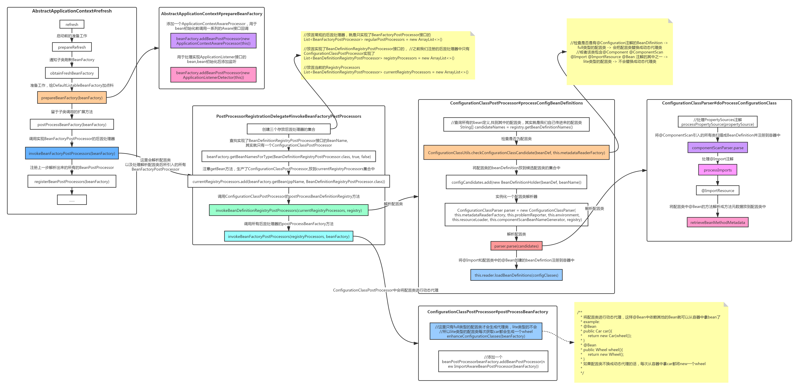

# Spring源码分析之`BeanFactoryPostProcessor`调用过程

前文传送门：

1. [Spring源码分析之预启动流程](https://mp.weixin.qq.com/s/bfbPJOlYo2Vz2UTSMWRGkw)
2. [Spring源码分析之BeanFactory体系结构](https://mp.weixin.qq.com/s/FDx0hmCp7dEfw5wzhS3fNA)

本文内容：

1. `AbstractApplicationContext#refresh`前部分的一点小内容
2. `BeanFactoryPostProcessor`调用过程详解
3. `mybatis`是如何使用本节知识整合spring的？

正文：

在Spring中，一共分为`BeanFactoryPostProcessor`和`BeanPostProcessor`两类后置处理器，他们主要的职责如下：

- `BeanFactoryPostProcessor`：负责`beanClass`到`beanDefinition`的过程，包括但不限于寻找合适的`beanClass`，创建`beanDefinition`，修改`beanDefinition`，将`beanDefinition`注册到`BeanFactory`中
- `BeanPostProcessor`：负责`beanDefinition`到`bean`的过程，包括但不限于`bean`的属性赋值，初始化

本次主要分析`BeanFactoryPostProcessor`的调用过程，下面是`BeanFactoryPostProcessor`调用过程的大体流程图，也是本文想要表述的大概内容，原图链接: [BeanFactoryPostProcessor调用过程]( https://www.processon.com/view/link/5f6aa11fe0b34d2c46b88d86)




## refresh的前半段流程

```java
// 启动前的准备工作
prepareRefresh();
// 由于web项目中并不会先引入DefaultListableBeanFactory，在这里通知子类刷新BeanFactory
// 而我们是使用new AnnotationConfigApplicationContext()的方式，就是直接返回之前引入的DefaultListableBeanFactory
ConfigurableListableBeanFactory beanFactory = obtainFreshBeanFactory();
// 准备工作，给DefaultListableBeanFactory填充属性
prepareBeanFactory(beanFactory);
// 留于子类调用的扩展方法
postProcessBeanFactory(beanFactory);
// 调用实现BeanFactoryPostProcessor的后置处理器，
// 其实就是我们在new AnnotatedBeanDefinitionReader时注册的解析配置类的后置处理器ConfigurationClassPostProcessor
// 这里会解析配置类以及处理解析配置类后所引入的所有BeanFactoryPostProcessor
invokeBeanFactoryPostProcessors(beanFactory);
// 注册上一步解析出来的所有的BeanPostProcessor
// 注册逻辑和上一步大致相同，PriorityOrdered-> Ordered -> 普通的
registerBeanPostProcessors(beanFactory);
```

### prepareRefresh

```java
// 设置容器状态
this.closed.set(false);
this.active.set(true);
```

### prepareBeanFactory

```java
// 添加一个ApplicationContextAwareProcessor，用于bean初始化前调用一系列的Aware接口回调
beanFactory.addBeanPostProcessor(new ApplicationContextAwareProcessor(this));
// 用于处理实现ApplicationListener接口的bean,bean初始化后添加监听
beanFactory.addBeanPostProcessor(new ApplicationListenerDetector(this));
```


## invokeBeanFactoryPostProcessors（重点）

此方法将解析配置类以及处理解析配置类后所引入的所有BeanFactoryPostProcessor

> 温馨提醒：内容较多，还请耐心阅读~

```java
protected void invokeBeanFactoryPostProcessors(ConfigurableListableBeanFactory beanFactory) {
    //由于之前注册的都是BeanDefinition,此时还并没有生产任何的BeanFactoryPostProcessor，所以getBeanFactoryPostProcessors是空的
    PostProcessorRegistrationDelegate.invokeBeanFactoryPostProcessors(beanFactory, getBeanFactoryPostProcessors());

}
```

### invokeBeanFactoryPostProcessors

前部分主要是寻找ConfigurationClassPostProcessor并将它实例化

```java
//放置已处理的beanName
Set<String> processedBeans = new HashSet<>();
//放置常规的后置处理器，就是只实现了BeanFactoryPostProcessor接口的
List<BeanFactoryPostProcessor> regularPostProcessors = new ArrayList<>();
//放置实现了BeanDefinitionRegistryPostProcessor接口的，之前我们注册的后置处理器中只有ConfigurationClassPostProcessor实现了
List<BeanDefinitionRegistryPostProcessor> registryProcessors = new ArrayList<>();
//放置当前的RegistryProcessors
List<BeanDefinitionRegistryPostProcessor> currentRegistryProcessors = new ArrayList<>();
//查找实现了BeanDefinitionRegistryPostProcessor接口的BeanName,其实就只有一个ConfigurationClassPostProcessor
String[] postProcessorNames =
    beanFactory.getBeanNamesForType(BeanDefinitionRegistryPostProcessor.class, true, false);
for (String ppName : postProcessorNames) {
    //ConfigurationClassPostProcessor同样实现了PriorityOrdered接口
    if (beanFactory.isTypeMatch(ppName, PriorityOrdered.class)) {
        //注意这里调用了getBean方法，生产了ConfigurationClassPostProcessor,放到currentRegistryProcessors集合中
        currentRegistryProcessors.add(beanFactory.getBean(ppName, BeanDefinitionRegistryPostProcessor.class));
        processedBeans.add(ppName);
    }
}
//排序
sortPostProcessors(currentRegistryProcessors, beanFactory);
//将生产出来的后置处理器放到集合中
registryProcessors.addAll(currentRegistryProcessors);
```

接下来就开始调用ConfigurationClassPostProcessor的postProcessBeanDefinitionRegistry方法

```java
//调用ConfigurationClassPostProcessor的postProcessBeanDefinitionRegistry方法
invokeBeanDefinitionRegistryPostProcessors(currentRegistryProcessors, registry);

private static void invokeBeanDefinitionRegistryPostProcessors(
    Collection<? extends BeanDefinitionRegistryPostProcessor> postProcessors, BeanDefinitionRegistry registry) {
	//循环BeanDefinitionRegistryPostProcessor进行调用
    for (BeanDefinitionRegistryPostProcessor postProcessor : postProcessors) {
        postProcessor.postProcessBeanDefinitionRegistry(registry);
    }
}
```

### postProcessBeanDefinitionRegistry

```java
public void postProcessBeanDefinitionRegistry(BeanDefinitionRegistry registry) {
    processConfigBeanDefinitions(registry);
}
```

```java
public void processConfigBeanDefinitions(BeanDefinitionRegistry registry) {
	//放置候选配置类
    List<BeanDefinitionHolder> configCandidates = new ArrayList<>();
    String[] candidateNames = registry.getBeanDefinitionNames();
    //遍历之前注册的所有bean定义，找到其中的配置类，其实就是我们自己传进来的配置类
    for (String beanName : candidateNames) {
        //...省略校验过程...
        BeanDefinition beanDef = registry.getBeanDefinition(beanName);
        //检查是否是有@Configuration注解的BeanDifinition -> full类型的配置类 -> 会把配置类替换成动态代理类
        //或者该类包含@Component @ComponentScan @Import @ImportResource @Bean 注解的其中之一 -> lite类型的配置类  -> 不会替换成动态代理类
        else if (ConfigurationClassUtils.checkConfigurationClassCandidate(beanDef, this.metadataReaderFactory)) {
            configCandidates.add(new BeanDefinitionHolder(beanDef, beanName));
        }
    }
    //....省略片段....
    //实例化一个配置类解析器
    ConfigurationClassParser parser = new ConfigurationClassParser(
        this.metadataReaderFactory, this.problemReporter, this.environment,
        this.resourceLoader, this.componentScanBeanNameGenerator, registry);
    
    do {
        //解析配置类
        parser.parse(candidates);
        parser.validate();
        //parser.getConfigurationClasses()就是拿到刚刚解析完放到map中的配置类
        Set<ConfigurationClass> configClasses = new LinkedHashSet<>(parser.getConfigurationClasses());
        configClasses.removeAll(alreadyParsed);
        
        //这里处理@Import导入的beanDefintion和配置类中的@Bean
        this.reader.loadBeanDefinitions(configClasses);
        alreadyParsed.addAll(configClasses);
		//以下逻辑是找出未解析的配置类，如@Bean和ImportBeanDefinitionRegistrar所引入的
        candidates.clear();
        if (registry.getBeanDefinitionCount() > candidateNames.length) {
            String[] newCandidateNames = registry.getBeanDefinitionNames();
            Set<String> oldCandidateNames = new HashSet<>(Arrays.asList(candidateNames));
            Set<String> alreadyParsedClasses = new HashSet<>();
            for (ConfigurationClass configurationClass : alreadyParsed) {
                alreadyParsedClasses.add(configurationClass.getMetadata().getClassName());
            }
            for (String candidateName : newCandidateNames) {
                if (!oldCandidateNames.contains(candidateName)) {
                    BeanDefinition bd = registry.getBeanDefinition(candidateName);
                    //将是配置类并且没有解析过的BeanDefinition放到候选集合中继续解析
                    if (ConfigurationClassUtils.checkConfigurationClassCandidate(bd, this.metadataReaderFactory) &&
                        !alreadyParsedClasses.contains(bd.getBeanClassName())) {
                        candidates.add(new BeanDefinitionHolder(bd, candidateName));
                    }
                }
            }
            candidateNames = newCandidateNames;
        }
    }
    while (!candidates.isEmpty());
}
```

> ConfigurationClassUtils.checkConfigurationClassCandidate中的摘取片段

```java
//检查是否有标识@Configuration
Map<String, Object> config = metadata.getAnnotationAttributes(Configuration.class.getName());
if (config != null && !Boolean.FALSE.equals(config.get("proxyBeanMethods"))) {
    //设置配置属性值为full
    beanDef.setAttribute(CONFIGURATION_CLASS_ATTRIBUTE, CONFIGURATION_CLASS_FULL);
}
//检查是否包含@Component @ComponentScan @Import @ImportResource @Bean
else if (config != null || isConfigurationCandidate(metadata)) {
    //设置配置属性值为lite
    beanDef.setAttribute(CONFIGURATION_CLASS_ATTRIBUTE, CONFIGURATION_CLASS_LITE);
}
else {
    return false;
}
```

### 配置类解析流程(parser.parse(candidates))

```java
public void parse(Set<BeanDefinitionHolder> configCandidates) {
    for (BeanDefinitionHolder holder : configCandidates) {
        BeanDefinition bd = holder.getBeanDefinition();
        //配置类的beanDefinition为AnnotatedGenericBeanDefinition，true
        if (bd instanceof AnnotatedBeanDefinition) {
            //传入配置类的元数据与beanName
            parse(((AnnotatedBeanDefinition) bd).getMetadata(), holder.getBeanName());
        }
    }
}
protected final void parse(AnnotationMetadata metadata, String beanName) throws IOException {
    processConfigurationClass(new ConfigurationClass(metadata, beanName), DEFAULT_EXCLUSION_FILTER);
}
```

#### processConfigurationClass

```java
protected void processConfigurationClass(ConfigurationClass configClass, Predicate<String> filter) throws IOException {
    SourceClass sourceClass = asSourceClass(configClass, filter);
    do {
        //解析配置类，这里可能返回配置类的父类，需要继续处理
        sourceClass = doProcessConfigurationClass(configClass, sourceClass, filter);
    }
    while (sourceClass != null);
    //将配置类放入map中
    this.configurationClasses.put(configClass, configClass);
}
```

#### doProcessConfigurationClass

```java
//@Configuration 本身也是 @Component的组合注解
if (configClass.getMetadata().isAnnotated(Component.class.getName())) {
    // 处理内置类，如果内置类也是个配置类，递归处理内置类
    processMemberClasses(configClass, sourceClass, filter);
}
```

#### 处理@ComponentScan

```java
// Process any @ComponentScan annotations
// 找出配置类上的@ComponentScan注解属性
Set<AnnotationAttributes> componentScans = AnnotationConfigUtils.attributesForRepeatable(
    sourceClass.getMetadata(), ComponentScans.class, ComponentScan.class);

for (AnnotationAttributes componentScan : componentScans) {
    //将@ComponentScan引入的所有类扫描成BeanDefinition并注册到容器中
    Set<BeanDefinitionHolder> scannedBeanDefinitions =
        this.componentScanParser.parse(componentScan, sourceClass.getMetadata().getClassName());
    //这里循环是为了判断扫描出来的beanDefinition是否是配置类，如果是配置类的话需要递归解析
    for (BeanDefinitionHolder holder : scannedBeanDefinitions) {
        BeanDefinition bdCand = holder.getBeanDefinition().getOriginatingBeanDefinition();
        //这里是必然为true, 能被扫描出来的必然有@Component注解，而@Component注解为lite配置类
        //这里主要是为了在检查的同时设置一下full或者lite的类型
        if (ConfigurationClassUtils.checkConfigurationClassCandidate(bdCand, this.metadataReaderFactory)) {
            //配置类就继续递归解析
            parse(bdCand.getBeanClassName(), holder.getBeanName());
        }
    }
}
```

##### this.componentScanParser.parse

```java
public Set<BeanDefinitionHolder> parse(AnnotationAttributes componentScan, final String declaringClass) {
    //重新new了一个classpath的bean定义扫描器，没用我们最开始创建的
    // 这里添加了一个默认的过滤器，过滤@Component注解的
    ClassPathBeanDefinitionScanner scanner = new ClassPathBeanDefinitionScanner(this.registry,
                                                                        componentScan.getBoolean("useDefaultFilters"), this.environment, this.resourceLoader);
    //添加自己配置的过滤器
    for (AnnotationAttributes filter : componentScan.getAnnotationArray("includeFilters")) {
        for (TypeFilter typeFilter : typeFiltersFor(filter)) {
            scanner.addIncludeFilter(typeFilter);
        }
    }
    for (AnnotationAttributes filter : componentScan.getAnnotationArray("excludeFilters")) {
        for (TypeFilter typeFilter : typeFiltersFor(filter)) {
            scanner.addExcludeFilter(typeFilter);
        }
    }
    //如果配置的为懒加载，则扫描出来的所有BeanDefinition都默认为懒加载的
    boolean lazyInit = componentScan.getBoolean("lazyInit");
    if (lazyInit) {
        scanner.getBeanDefinitionDefaults().setLazyInit(true);
    }
    //将配置的basePackages中所有的包路径放到set集合中，保证最终所有的包路径唯一
    Set<String> basePackages = new LinkedHashSet<>();
    String[] basePackagesArray = componentScan.getStringArray("basePackages");
    for (String pkg : basePackagesArray) {
        String[] tokenized = StringUtils.tokenizeToStringArray(this.environment.resolvePlaceholders(pkg),
                                                               ConfigurableApplicationContext.CONFIG_LOCATION_DELIMITERS);
        Collections.addAll(basePackages, tokenized);
    }
    //添加一个排除过滤器，排除该配置类
    scanner.addExcludeFilter(new AbstractTypeHierarchyTraversingFilter(false, false) {
        @Override
        protected boolean matchClassName(String className) {
            return declaringClass.equals(className);
        }
    });
    //开始扫描
    return scanner.doScan(StringUtils.toStringArray(basePackages));
}
```

##### doScan

```java
protected Set<BeanDefinitionHolder> doScan(String... basePackages) {
    Assert.notEmpty(basePackages, "At least one base package must be specified");
    Set<BeanDefinitionHolder> beanDefinitions = new LinkedHashSet<>();
    for (String basePackage : basePackages) {
        //找到所有候选的bean -> 默认过滤器为过滤标识了@Component注解的class
        Set<BeanDefinition> candidates = findCandidateComponents(basePackage);
        for (BeanDefinition candidate : candidates) {
            String beanName = this.beanNameGenerator.generateBeanName(candidate, this.registry);
            if (candidate instanceof AbstractBeanDefinition) {
                //设置默认值，比如上一个方法刚刚设置的是否懒加载
                postProcessBeanDefinition((AbstractBeanDefinition) candidate, beanName);
            }
            if (candidate instanceof AnnotatedBeanDefinition) {
                //解析beanClass的所有注解填充到beanDefinition中，@Lazy @Primary @DependsOn @Role @Description
                AnnotationConfigUtils.processCommonDefinitionAnnotations((AnnotatedBeanDefinition) candidate);
            }
            //检查之前是否注册过，未注册返回true
            if (checkCandidate(beanName, candidate)) {
                BeanDefinitionHolder definitionHolder = new BeanDefinitionHolder(candidate, beanName);
                beanDefinitions.add(definitionHolder);
                //将beanDefinition注册到容器中
                registerBeanDefinition(definitionHolder, this.registry);
            }
        }
    }
    return beanDefinitions;
}
```

##### 寻找候选组件#findCandidateComponents

```java
public Set<BeanDefinition> findCandidateComponents(String basePackage) {
    return scanCandidateComponents(basePackage);
}
```

```java
private Set<BeanDefinition> scanCandidateComponents(String basePackage) {
    Set<BeanDefinition> candidates = new LinkedHashSet<>();
    //将类路径替换成绝对路径
    String packageSearchPath = ResourcePatternResolver.CLASSPATH_ALL_URL_PREFIX +
        resolveBasePackage(basePackage) + '/' + this.resourcePattern;
    //找出该路径下的所有类资源
    Resource[] resources = getResourcePatternResolver().getResources(packageSearchPath);
    for (Resource resource : resources) {
        if (resource.isReadable()) {
            MetadataReader metadataReader = getMetadataReaderFactory().getMetadataReader(resource);
            //调用刚刚配置的过滤器进行匹配，
            //默认过滤器逻辑：是否标识了@Component注解（包括组合的，如@Service）
            if (isCandidateComponent(metadataReader)) {
                //通过扫描方式创建的BeanDefintion为ScannedGenericBeanDefinition
                ScannedGenericBeanDefinition sbd = new ScannedGenericBeanDefinition(metadataReader);
                sbd.setSource(resource);
                //不是接口和抽象类,或者是抽象类但标识了@Lookup
                if (isCandidateComponent(sbd)) {
                    //将beanDefinition存到集合中
                    candidates.add(sbd);
                }
            }
        }
    }
    return candidates;
}
```

#### 处理@Import

```java
processImports(configClass, sourceClass, getImports(sourceClass), filter, true);
```

```java
private void processImports(ConfigurationClass configClass, SourceClass currentSourceClass,
                            Collection<SourceClass> importCandidates, Predicate<String> exclusionFilter,
                            boolean checkForCircularImports) {
//importCandidates为@Import中的value数组
    for (SourceClass candidate : importCandidates) {
        if (candidate.isAssignable(ImportSelector.class)) {
            // Candidate class is an ImportSelector -> delegate to it to determine imports
            Class<?> candidateClass = candidate.loadClass();
            //实例化我们写的实现ImportSelector接口的类
            ImportSelector selector = ParserStrategyUtils.instantiateClass(candidateClass, ImportSelector.class,
                                                                           this.environment, this.resourceLoader, this.registry);
            //调用selectImports方法返回我们需要注入到容器中bean数组
            String[] importClassNames = selector.selectImports(currentSourceClass.getMetadata());
            //转为SourceClass集合
            Collection<SourceClass> importSourceClasses = asSourceClasses(importClassNames, exclusionFilter);
            //再次递归调用本方法，如果我们返回的数组是一些没有实现Import相关接口的类，
            //就会走到最后的else逻辑，当成配置类处理
            processImports(configClass, currentSourceClass, importSourceClasses, exclusionFilter, false);
        }
        //这里就走实现ImportBeanDefinitionRegistrar接口的逻辑
        else if (candidate.isAssignable(ImportBeanDefinitionRegistrar.class)) {
            // Candidate class is an ImportBeanDefinitionRegistrar ->
            // delegate to it to register additional bean definitions
            Class<?> candidateClass = candidate.loadClass();
            //实例化
            ImportBeanDefinitionRegistrar registrar =
                ParserStrategyUtils.instantiateClass(candidateClass, ImportBeanDefinitionRegistrar.class,
                                                     this.environment, this.resourceLoader, this.registry);
            //这里先把Registrar放到配置类的importBeanDefinitionRegistrars属性中，最后解析完调用loadBeanDefinition进行处理
            configClass.addImportBeanDefinitionRegistrar(registrar, currentSourceClass.getMetadata());
        }
        else {
            //普通的bean当做配置类处理
            processConfigurationClass(candidate.asConfigClass(configClass), exclusionFilter);
        }
    }
}
```

#### 处理@Bean

```java
// 将配置类中@Bean的方法解析成方法元数据放到配置类中
Set<MethodMetadata> beanMethods = retrieveBeanMethodMetadata(sourceClass);
for (MethodMetadata methodMetadata : beanMethods) {
    configClass.addBeanMethod(new BeanMethod(methodMetadata, configClass));
}
```

> 到这里配置类的主要解析流程就已经结束了，接下来回到解析之后的流程

#### 处理@Import导入的beanDefintion和配置类中的@Bean

```java
this.reader.loadBeanDefinitions(configClasses);
public void loadBeanDefinitions(Set<ConfigurationClass> configurationModel) {
    TrackedConditionEvaluator trackedConditionEvaluator = new TrackedConditionEvaluator();
    //循环刚刚解析过的所有配置类
    for (ConfigurationClass configClass : configurationModel) {
        loadBeanDefinitionsForConfigurationClass(configClass, trackedConditionEvaluator);
    }
}
```

```java
private void loadBeanDefinitionsForConfigurationClass(
    ConfigurationClass configClass, TrackedConditionEvaluator trackedConditionEvaluator) {

    if (trackedConditionEvaluator.shouldSkip(configClass)) {
        String beanName = configClass.getBeanName();
        if (StringUtils.hasLength(beanName) && this.registry.containsBeanDefinition(beanName)) {
            this.registry.removeBeanDefinition(beanName);
        }
        this.importRegistry.removeImportingClass(configClass.getMetadata().getClassName());
        return;
    }
    // 将Import注解引入的class注册到容器的BeanDefinitionMap中
    if (configClass.isImported()) {
        registerBeanDefinitionForImportedConfigurationClass(configClass);
    }
    for (BeanMethod beanMethod : configClass.getBeanMethods()) {
        //将beanMethod转化成BeanDefinition注册到容器的beanDefinitionMap中
        loadBeanDefinitionsForBeanMethod(beanMethod);
    }

    loadBeanDefinitionsFromImportedResources(configClass.getImportedResources());
    //调用在解析Import时放入的ImportBeanDefinitionRegistrar的registerBeanDefinitions方法
    loadBeanDefinitionsFromRegistrars(configClass.getImportBeanDefinitionRegistrars());
}
```

##### 摘取处理BeanMethod逻辑如下

```java
private void loadBeanDefinitionsForBeanMethod(BeanMethod beanMethod) {
    ConfigurationClass configClass = beanMethod.getConfigurationClass();
    MethodMetadata metadata = beanMethod.getMetadata();
    String methodName = metadata.getMethodName();

    //解析出方法上@Bean注解的所有属性值
    AnnotationAttributes bean = AnnotationConfigUtils.attributesFor(metadata, Bean.class);
    //创建一个ConfigurationClassBeanDefinition，标识为通过@Bean注解注册的bean
    ConfigurationClassBeanDefinition beanDef = new ConfigurationClassBeanDefinition(configClass, metadata);
    beanDef.setSource(this.sourceExtractor.extractSource(metadata, configClass.getResource()));
    //以下逻辑为拿出@Bean中的属性填充到BeanDefinition中，最后注册容器中
    beanDef.setAutowireMode(AbstractBeanDefinition.AUTOWIRE_CONSTRUCTOR);
    //解析注解填充属性
    AnnotationConfigUtils.processCommonDefinitionAnnotations(beanDef, metadata);

    Autowire autowire = bean.getEnum("autowire");
    if (autowire.isAutowire()) {
        beanDef.setAutowireMode(autowire.value());
    }
    boolean autowireCandidate = bean.getBoolean("autowireCandidate");
    if (!autowireCandidate) {
        beanDef.setAutowireCandidate(false);
    }
    String initMethodName = bean.getString("initMethod");
    if (StringUtils.hasText(initMethodName)) {
        beanDef.setInitMethodName(initMethodName);
    }
    String destroyMethodName = bean.getString("destroyMethod");
    beanDef.setDestroyMethodName(destroyMethodName);
	//将创建的BeanDefinition注册到容器中
    this.registry.registerBeanDefinition(beanName, beanDefToRegister);
}
```

> 以上，ConfigurationClassPostProcessor的postProcessBeanDefinitionRegistry方法大致过程就这些了，接下来回到刚开始的invokeBeanFactoryPostProcessors方法

### invokeBeanFactoryPostProcessors

处理实现了Ordered接口的BeanDefinitionRegistryPostProcessor

```java
//...省略之前代码片段
//调用ConfigurationClassPostProcessor的postProcessBeanDefinitionRegistry方法
invokeBeanDefinitionRegistryPostProcessors(currentRegistryProcessors, registry);
//清空，以便处理后面的后置处理器
currentRegistryProcessors.clear();

//再次查找实现了BeanDefinitionRegistryPostProcessor接口的BeanName，这里就是从配置类中解析出来的一些
postProcessorNames = beanFactory.getBeanNamesForType(BeanDefinitionRegistryPostProcessor.class, true, false);
for (String ppName : postProcessorNames) {
    //不包括已经处理过的，并且先处理实现Ordered接口的
    if (!processedBeans.contains(ppName) && beanFactory.isTypeMatch(ppName, Ordered.class)) {
        currentRegistryProcessors.add(beanFactory.getBean(ppName, BeanDefinitionRegistryPostProcessor.class));
        processedBeans.add(ppName);
    }
}
//根据Ordered排序
sortPostProcessors(currentRegistryProcessors, beanFactory);
//将后置处理器放到已注册的集合中
registryProcessors.addAll(currentRegistryProcessors);
//调用所有后置处理器的postProcessBeanDefinitionRegistry方法
invokeBeanDefinitionRegistryPostProcessors(currentRegistryProcessors, registry);
//再次清理，因为后面还要处理未实现Ordered接口的
currentRegistryProcessors.clear();
```

最后需要循环处理剩下的所有后置处理器，因为可能从剩下的后置处理器中又解析出新的后置处理器

```java
//下面的逻辑和上面的一模一样，while循环处理所有剩下的后置处理器，直到全部处理完毕
boolean reiterate = true;
while (reiterate) {
    reiterate = false;
    postProcessorNames = beanFactory.getBeanNamesForType(BeanDefinitionRegistryPostProcessor.class, true, false);
    for (String ppName : postProcessorNames) {
        if (!processedBeans.contains(ppName)) {
            currentRegistryProcessors.add(beanFactory.getBean(ppName, BeanDefinitionRegistryPostProcessor.class));
            processedBeans.add(ppName);
            reiterate = true;
        }
    }
    sortPostProcessors(currentRegistryProcessors, beanFactory);
    registryProcessors.addAll(currentRegistryProcessors);
    invokeBeanDefinitionRegistryPostProcessors(currentRegistryProcessors, registry);
    currentRegistryProcessors.clear();
}
```

调用所有后置处理器的postProcessBeanFactory方法

```java
/**
* 调用所有后置处理器的postProcessBeanFactory方法,
* 如果自己没实现的话，Spring中只有一个内置的ConfigurationClassPostProcessor
* ConfigurationClassPostProcessor中的postProcessBeanFactory方法主要是将配置类换成动态代理
*/
invokeBeanFactoryPostProcessors(registryProcessors, beanFactory);
invokeBeanFactoryPostProcessors(regularPostProcessors, beanFactory);
```

> ConfigurationClassPostProcessor#postProcessBeanFactory

```java
public void postProcessBeanFactory(ConfigurableListableBeanFactory beanFactory) {
	//将所有配置类进行动态代理，这样@Bean中依赖其他的Bean就可以从容器中拿bean了
	/**
	 * example:
	 * @Bean
	 * public Car car(){
	 *     return new Car(wheel());
	 * }
	 * @Bean
	 * public Wheel wheel(){
	 *     return new Wheel();
	 * }
	 * 如果配置类不换成动态代理的话，每次从容器中拿car都将new一个wheel
	 * 注意，这里只有full类型的配置类才会生成代理类，lite类型的不会，
	 * 所以lite类型的配置类每次获取car都会生成一个wheel
	 */
	enhanceConfigurationClasses(beanFactory);
	//添加一个beanPostProcessor
	beanFactory.addBeanPostProcessor(new ImportAwareBeanPostProcessor(beanFactory));
}
```

最后处理实现了BeanFactoryPostProcessor接口的后置处理器

```java
//处理方式与BeanDefinitionRegistryPostProcessor相同
//找出所有实现了BeanDefinitionRegistryPostProcessor的后置处理器
String[] postProcessorNames =
				beanFactory.getBeanNamesForType(BeanFactoryPostProcessor.class, true, false);
//先处理实现PriorityOrdered接口的
invokeBeanFactoryPostProcessors(priorityOrderedPostProcessors, beanFactory);
//在处理实现Ordered接口的
invokeBeanFactoryPostProcessors(orderedPostProcessors, beanFactory);
//最后处理普通的
invokeBeanFactoryPostProcessors(nonOrderedPostProcessors, beanFactory);
```

> 到这里，关于`BeanFactoryPostProcessor`调用过程就已经完结了

### 关于`BeanDefinition`的小彩蛋

解析配置类的流程我们已经分析完了，那么在这过程中用了多少种`BeanDefinition`呢？他们对应的类型又是什么呢？这里附上本文的一个小彩蛋。

- `AnnotatedGenericBeanDefinition`：在开始传入的配置类，以及通过@Import注解引入的Bean
- `ScannedGenericBeanDefinition`：通过@Component扫描包引入的Bean
- `ConfigurationClassBeanDefinition`：通过@Bean注解引入的Bean
- `RootBeanDefinition`：Spring内部使用，如生产Bean时将其他`BeanDefinition`转成`RootBeanDefinition`

## Mybatis 如何整合 Spring的?

> 此节知识为概要知识，具体内容将放在Mybatis源码系列详细说明

先带大家理理思路~

我们知道，在Spring中是可以通过扫描的方式扫描出标识了`@Component`注解的class注册到容器中，并且该class不能为一个接口类(忘了请看上面的扫描逻辑)，而我们的`mapper`通常又是一个接口类，这是默认不允许被注册的。那么该如何解决这个问题呢？

思考：既然默认不允许是接口类，那么我们是否可以自定义一个扫码器继承Spring的扫描器，然后重写其中判断是否为接口类的逻辑，这样，我们不就可以使用我们自定义的扫描器去扫描包就可以了吗？

问题2：假设上面的方法可行，但是我们扫描出来的`BeanDefintion`是个接口，接口是不能被实例化的，那在后面我们`createBean`中的实例化步骤又该如何解决呢？

思考：我们知道其实我们的`mapper`在`mybatis`中本来就是个接口，我们创建时是通过`sqlSessionTemplate.getMapper()`的方式创建的，这里其实是生成了一个代理类返回给我们，那我们应该如何将这个代理类给接到Spring的`createBean`过程中呢，如何接过去了岂不是就万事大吉？

小知识：嘿，不知道大家还记不记的我们的`bean`里有一种特殊的`bean`称为`FactoryBean`，我们这个`FactoryBean`最后从容器中获取出来时其实是先拿到这个`FactoryBean`，然后调用它的`getObject()`方法返回我们真正需要的`bean`

思考：知道这个之后，那么我们是不是可以使用`FactoryBean`，然后将扫描出来的接口(mapper)放到`FactoryBean`的属性中，最后从容器中获取时只要这样：

```java
public class FactoryBean{
    private Class mapper;
    public Object getObject(){
        sqlSessionTemplate.getMappper(mapper);
    }
}
```

嘿，看看是不是好像搞定啦~

现在问题好像都已经解决了，那剩下的就是怎么让Spring在启动的时候调用我们的自定义扫描器呢？我们现在就来看看源码吧

### @MapperScan

`Mybatis`整合`Spring`当然是从`@MapperScan`注解看起，因为我们通常情况只加这个注解就可以了

@MapperScan简要内容如下

```java
// 组合注解，组合了@Import注解，再通过@Import注解导入了MapperScannerRegistrar类
@Import(MapperScannerRegistrar.class)
public @interface MapperScan{
	// 包路径
	String[] basePackages() default {}
}
```

### MapperScannerRegistrar

```java
// 实现的是ImportBeanDefinitionRegistrar接口
public class MapperScannerRegistrar implements ImportBeanDefinitionRegistrar, ResourceLoaderAware{
    
}
```

registerBeanDefinitions

```java
@Override
public void registerBeanDefinitions(AnnotationMetadata importingClassMetadata, BeanDefinitionRegistry registry) {
	// 从元数据中拿到@MapperScan的信息
    AnnotationAttributes annoAttrs = AnnotationAttributes.fromMap(importingClassMetadata.getAnnotationAttributes(MapperScan.class.getName()));
    // 实例化一个自定义的扫描器
    ClassPathMapperScanner scanner = new ClassPathMapperScanner(registry);
	
    // 下面都是些属性填充，由于一般我们只配一个包路径，所以下面除了包路径，其他都是null
    if (resourceLoader != null) {
        scanner.setResourceLoader(resourceLoader);
    }

    Class<? extends Annotation> annotationClass = annoAttrs.getClass("annotationClass");
    if (!Annotation.class.equals(annotationClass)) {
        scanner.setAnnotationClass(annotationClass);
    }

    Class<?> markerInterface = annoAttrs.getClass("markerInterface");
    if (!Class.class.equals(markerInterface)) {
        scanner.setMarkerInterface(markerInterface);
    }

    Class<? extends BeanNameGenerator> generatorClass = annoAttrs.getClass("nameGenerator");
    if (!BeanNameGenerator.class.equals(generatorClass)) {
        scanner.setBeanNameGenerator(BeanUtils.instantiateClass(generatorClass));
    }

    Class<? extends MapperFactoryBean> mapperFactoryBeanClass = annoAttrs.getClass("factoryBean");
    if (!MapperFactoryBean.class.equals(mapperFactoryBeanClass)) {
        scanner.setMapperFactoryBean(BeanUtils.instantiateClass(mapperFactoryBeanClass));
    }

    scanner.setSqlSessionTemplateBeanName(annoAttrs.getString("sqlSessionTemplateRef"));
    scanner.setSqlSessionFactoryBeanName(annoAttrs.getString("sqlSessionFactoryRef"));

    List<String> basePackages = new ArrayList<String>();
    for (String pkg : annoAttrs.getStringArray("value")) {
        if (StringUtils.hasText(pkg)) {
            basePackages.add(pkg);
        }
    }
    for (String pkg : annoAttrs.getStringArray("basePackages")) {
        if (StringUtils.hasText(pkg)) {
            basePackages.add(pkg);
        }
    }
    for (Class<?> clazz : annoAttrs.getClassArray("basePackageClasses")) {
        basePackages.add(ClassUtils.getPackageName(clazz));
    }
    // 注册自定义的过滤器，我们啥也没配，所以扫描出来的所以接口都通过
    scanner.registerFilters();
    // 开始扫描
    scanner.doScan(StringUtils.toStringArray(basePackages));
}
```

scanner.registerFilters中的有效片段

```java
// 添加一个直接返回true的过滤器
addIncludeFilter(new TypeFilter() {
    @Override
    public boolean match(MetadataReader metadataReader, MetadataReaderFactory metadataReaderFactory) throws IOException {
        return true;
    }
});
```

doScan

```java
public Set<BeanDefinitionHolder> doScan(String... basePackages) {
    // 直接走的就是Spring的扫描逻辑了，但现在过滤器只有一个默认全放行的
    Set<BeanDefinitionHolder> beanDefinitions = super.doScan(basePackages);

    if (beanDefinitions.isEmpty()) {
        logger.warn("No MyBatis mapper was found in '" + Arrays.toString(basePackages) + "' package. Please check your configuration.");
    } else {
		// 处理扫描出来的BeanDefinition，这里就是我们思考中搞成`FactoryBean`的逻辑
        processBeanDefinitions(beanDefinitions);
    }
    return beanDefinitions;
}
```

我们思考中重写的扫描逻辑

```java
@Override
protected boolean isCandidateComponent(AnnotatedBeanDefinition beanDefinition) {
    // 放行是接口的类
    return beanDefinition.getMetadata().isInterface() && beanDefinition.getMetadata().isIndependent();
}
```

摘取processBeanDefinitions中的代码片段

```java
private void processBeanDefinitions(Set<BeanDefinitionHolder> beanDefinitions) {
    GenericBeanDefinition definition;
    for (BeanDefinitionHolder holder : beanDefinitions) {
        definition = (GenericBeanDefinition) holder.getBeanDefinition();
        // 将原来的接口mapper放到beanDefintion的构造方法参数中，以指定的构造方法实例化
  definition.getConstructorArgumentValues().addGenericArgumentValue(definition.getBeanClassName()); 
        // 注意这里：将原来的beanClass替换成FactoryBean了！
        definition.setBeanClass(this.mapperFactoryBean.getClass());
    }
}
```

Mybatis整合Spring的过程大致就是这些了

> 本文内容就是以上这些了，希望小伙伴们有所收获，有问题的小伙伴欢迎在下方留言哦