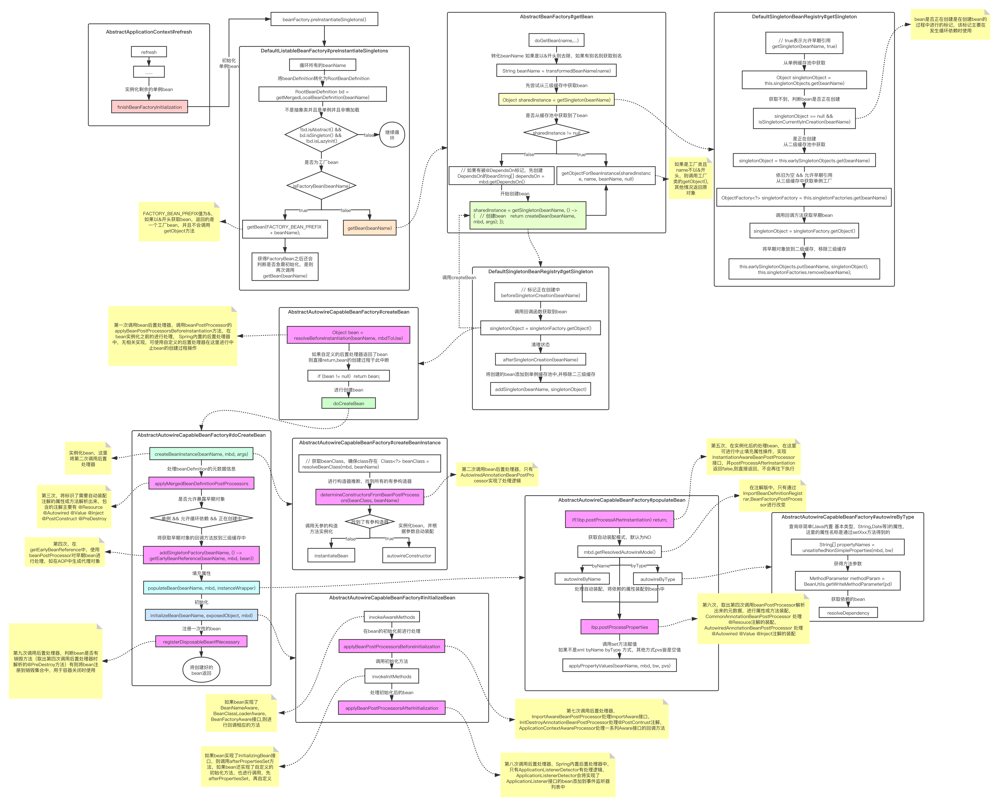

# Spring源码分析之Bean的创建过程详解

前文传送门：

1. [Spring源码分析之预启动流程](https://mp.weixin.qq.com/s/bfbPJOlYo2Vz2UTSMWRGkw)
2. [Spring源码分析之BeanFactory体系结构](https://mp.weixin.qq.com/s/FDx0hmCp7dEfw5wzhS3fNA)
3. [Spring源码分析之BeanFactoryPostProcessor调用过程详解](https://mp.weixin.qq.com/s/gHL6Q0A0xwxSCZ0_hKJhEQ)

本文内容：

1. 在IOC中，是如何通过beanDefition创建出一个bean的？
2. 各BeanPostProcessor在这过程中扮演的角色，调用时机？

话不多说，直接正题走起，上图！

下面是bean创建过程的大致流程图，本文将以图中顺序进行逐步源码分析，小伙伴亦可与图中流程边对照边品食

原矢量图地址：https://www.processon.com/view/link/5f6174431e08531edf3134fb



我们知道，在Spring IOC前段部分有注册了一系列的BeanPostProcessor，在Bean的创建过程中，就将要使用到他们了，下面我给大家一一列出

- AutowiredAnnotationBeanPostProcessor：在`new AnnotatedBeanDefinitionReader`时注册
- CommonAnnotationBeanPostProcessor: 在`new AnnotatedBeanDefinitionReader`时注册
- ApplicationContextAwareProcessor: 在`prepareBeanFactory`时注册
- ApplicationListenerDetector:  在`prepareBeanFactory`时注册
- ImportAwareBeanPostProcessor: 在配置类后置处理器调用`postProcessBeanFactory`注册

- BeanPostProcessorChecker：在`registerBeanPostProcessors`时注册

> 以上就是Spring中内置的所有BeanPostProcessor了

同样，我们先从最开始的入口`refresh`开始分析

```java
public void refresh(){
  //....省略前面部分
  // 实例化剩余的单例bean
  finishBeanFactoryInitialization(beanFactory);
}
```

## finishBeanFactoryInitialization

```java
protected void finishBeanFactoryInitialization(ConfigurableListableBeanFactory beanFactory){
  // 将所有非懒加载的bean加载到容器中
	beanFactory.preInstantiateSingletons();
}
```

循环我们之前注册的所有beanDefinition，一个个的进行调用getBean注册到容器中

```java
public void preInstantiateSingletons(){
  // 循环所有beanDefinition
  for (String beanName : beanNames) {
    // 将beanDefinition转化为RootBeanDefinition
    RootBeanDefinition bd = getMergedLocalBeanDefinition(beanName);
    // 不是抽象类并且是单例并且非懒加载
    if (!bd.isAbstract() && bd.isSingleton() && !bd.isLazyInit()) {
      // 是否为工厂bean
      if (isFactoryBean(beanName)) {
        // 由于是以&开头获取bean,这里返回的是一个工厂bean，并且不会调用getObject方法
        Object bean = getBean(FACTORY_BEAN_PREFIX + beanName);
        if (bean instanceof FactoryBean) {
          // 判断是否要立即初始化bean
          FactoryBean<?> factory = (FactoryBean<?>) bean;
          boolean isEagerInit = (factory instanceof SmartFactoryBean &&
                           ((SmartFactoryBean<?>) factory).isEagerInit());
          if (isEagerInit) {
            // 以为&开头的方式再获取一次，此时会调用FactoryBean的getObject()方法
            getBean(beanName);
          }
        }
      }
      else {
        // 不是FactoryBean，直接使用getBean进行初始化
        getBean(beanName);
      }
    }
  }
}
```

接下来就是Spring的常规操作，调用do开头的doGetBean

```java
public Object getBean(String name) throws BeansException {
  return doGetBean(name, null, null, false);
}
```

以下为`doGetBean`中获取单例bean的逻辑

```java
// 转化beanName 如果是以&开头则去除，如果有别名则获取别名
String beanName = transformedBeanName(name);
// 尝试从三级缓存中获取bean
Object sharedInstance = getSingleton(beanName);
// 是否从缓存中获取到了bean
if (sharedInstance != null && args == null) {
  // 如果是工厂类且name不以&开头，则调用工厂类的getObject()
  // 其他情况返回原对象
  bean = getObjectForBeanInstance(sharedInstance, name, beanName, null);
}
```

### getSingleton

```java
public Object getSingleton(String beanName) {
		return getSingleton(beanName, true);
}
```

```java
protected Object getSingleton(String beanName, boolean allowEarlyReference) {
		// 从单例缓存池中获取
		Object singletonObject = this.singletonObjects.get(beanName);
		// 获取不到，判断bean是否正在创建
    // 如果是正在创建，2种情况 1.多个线程在创建bean 2.发生循环依赖
    // 如果是多个线程，则由于同步锁阻塞于此
    // 循环依赖的问题较为复杂，将在下章详细分析
		if (singletonObject == null && isSingletonCurrentlyInCreation(beanName)) {
			synchronized (this.singletonObjects) {
				// 从早期对象缓存池中获取
				singletonObject = this.earlySingletonObjects.get(beanName);
				if (singletonObject == null && allowEarlyReference) {
					// 从三级缓存中获取单例工厂
					ObjectFactory<?> singletonFactory = this.singletonFactories.get(beanName);
					if (singletonFactory != null) {
						// 调用回调方法获取早期bean
						singletonObject = singletonFactory.getObject();
						// 将早期对象放到二级缓存，移除三级缓存
						this.earlySingletonObjects.put(beanName, singletonObject);
						this.singletonFactories.remove(beanName);
					}
				}
			}
		}
		return singletonObject;
	}
```

### getObjectForBeanInstance

```java
protected Object getObjectForBeanInstance(
			Object beanInstance, String name, String beanName, @Nullable RootBeanDefinition mbd) {
		// 判断name是否以&开头，是则直接返回该FactoryBean
    /*public static boolean isFactoryDereference(@Nullable String name) {
				return (name != null && name.startsWith(BeanFactory.FACTORY_BEAN_PREFIX));
		}*/
		if (BeanFactoryUtils.isFactoryDereference(name)) {
			return beanInstance;
		}
		// 不是工厂bean直接返回原对象
		if (!(beanInstance instanceof FactoryBean)) {
			return beanInstance;
		}
		// 尝试从缓存中获取，保证多次从工厂bean获取的bean是同一个bean
		object = getCachedObjectForFactoryBean(beanName);
		if (object == null) {
			FactoryBean<?> factory = (FactoryBean<?>) beanInstance;
			boolean synthetic = (mbd != null && mbd.isSynthetic());
      // 从FactoryBean获取对象
			object = getObjectFromFactoryBean(factory, beanName, !synthetic);
		}
		return object;
	}
```

getObjectFromFactoryBean的代码摘取片段

```java
protected Object getObjectFromFactoryBean(FactoryBean<?> factory, String beanName, boolean shouldPostProcess){
  // 获取bean，调用factoryBean的getObject()
	object = doGetObjectFromFactoryBean(factory, beanName);
}
```

```java
private Object doGetObjectFromFactoryBean(FactoryBean<?> factory, String beanName){
  object = factory.getObject();
}
```

> 以上为从缓存中获取到bean，处理FactoryBean的逻辑，接下来我们看看实际创建bean的过程

以下为续接上面`doGetBean`中未从缓存中获取到bean的逻辑

```java
// 如果有被@DependsOn标记，先创建DependsOn的bean
String[] dependsOn = mbd.getDependsOn();
if (dependsOn != null) {
  for (String dep : dependsOn) {
    registerDependentBean(dep, beanName);
    getBean(dep);
  }
}
// 单例bean
if (mbd.isSingleton()) {
  // 开始创建bean
  sharedInstance = getSingleton(beanName, () -> {
    // 真正创建bean
    return createBean(beanName, mbd, args);
  });
  // 如果是工厂类且name不以&开头，则调用工厂类的getObject()
  // 其他情况返回原对象
  bean = getObjectForBeanInstance(sharedInstance, name, beanName, mbd);
}
```

### getSingleton，此方法为重载方法，与从缓存中获取bean并非同一个

```java
public Object getSingleton(String beanName, ObjectFactory<?> singletonFactory) {
		Assert.notNull(beanName, "Bean name must not be null");
		// 开始创建bean时加锁，注意这个锁的同步对象与从缓存中获取时锁的同步对象相同
		synchronized (this.singletonObjects) {
			// 再次从缓存中获取，有直接返回，出现有的情况
			// 1.线程一正在创建A实例，线程二尝试获取，被同步锁阻塞
			// 2.线程一创建完毕，线程二进入同步代码块，从缓存中获取直接返回
			Object singletonObject = this.singletonObjects.get(beanName);
			if (singletonObject == null) {
				// 标记正在创建中
				beforeSingletonCreation(beanName);
				boolean newSingleton = false;
				try {
					// 调用回调函数获取到bean
					singletonObject = singletonFactory.getObject();
					newSingleton = true;
				}
				finally {
					// 清理状态
					afterSingletonCreation(beanName);
				}
				if (newSingleton) {
					// 将创建的bean添加到单例缓存池中,并移除二三级缓存
					addSingleton(beanName, singletonObject);
				}
			}
			return singletonObject;
		}
	}
```

### createBean，终于开始创建bean了～

```java
protected Object createBean(String beanName, RootBeanDefinition mbd, @Nullable Object[] args){
  // 第一次调用bean后置处理器，在bean实例化之前的进行处理
  // Spring内置的后置处理器中，无相关实现
  // 可使用自定义的后置处理器在这里进行中止bean的创建过程操作
  Object bean = resolveBeforeInstantiation(beanName, mbdToUse);
  if (bean != null) {
    // 如果自定义的后置处理器返回了bean，则直接return,bean的创建过程于此中断
    return bean;
  }
  // 进行创建bean
	Object beanInstance = doCreateBean(beanName, mbdToUse, args);
}
```

```java
protected Object doCreateBean(String beanName, RootBeanDefinition mbd, @Nullable Object[] args){
  // 实例化bean 第二次调用bean后置处理器，用于获取bean的有参构造器
	instanceWrapper = createBeanInstance(beanName, mbd, args);
  // 第三次 处理beanDefinition的元数据信息
  applyMergedBeanDefinitionPostProcessors(mbd, beanType, beanName);
  // 是否允许暴露早期对象
  boolean earlySingletonExposure = (mbd.isSingleton() && this.allowCircularReferences &&
                                    isSingletonCurrentlyInCreation(beanName));
  // 第四次 用于获取早期对象时的处理
  // 将获取早期对象的回调方法放到三级缓存中
  addSingletonFactory(beanName, () -> getEarlyBeanReference(beanName, mbd, bean));
  // 第五、六次，填充属性 可使用的方式 byName byType @Resource @Value @Autowired @Inject
	populateBean(beanName, mbd, instanceWrapper);
  // 第七、八次，初始化
	exposedObject = initializeBean(beanName, exposedObject, mbd);
  // 第九次 判断bean是否有销毁方法，有则将bean注册到销毁集合中，用于容器关闭时使用
	registerDisposableBeanIfNecessary(beanName, bean, mbd);
  // 返回创建好的bean
  return exposedObject;
}
```

> 你以为这就结束了？

接下来我们就来看看这里后置处理器到底做了什么吧

由于第一次调用并未有任何处理，我们从第二次调用开始分析

### createBeanInstance

```java
protected BeanWrapper createBeanInstance(String beanName, RootBeanDefinition mbd, @Nullable Object[] args){
  // 获取beanClass
	Class<?> beanClass = resolveBeanClass(mbd, beanName);
  // 使用AutowiredAnnotationBeanPostProcessor进行构造器推断，找到所有的有参构造器
  Constructor<?>[] ctors = determineConstructorsFromBeanPostProcessors(beanClass, beanName);
  if (ctors != null || mbd.getResolvedAutowireMode() == AUTOWIRE_CONSTRUCTOR ||
				mbd.hasConstructorArgumentValues() || !ObjectUtils.isEmpty(args)) {
    // 实例化bean，并根据参数自动装配
    return autowireConstructor(beanName, mbd, ctors, args);
  }
  // 调用无参的构造方法实例化
	return instantiateBean(beanName, mbd);
}
```

#### determineConstructorsFromBeanPostProcessors

```java
protected Constructor<?>[] determineConstructorsFromBeanPostProcessors(@Nullable Class<?> beanClass, String beanName)
			throws BeansException {
	
  if (beanClass != null && hasInstantiationAwareBeanPostProcessors()) {
    for (BeanPostProcessor bp : getBeanPostProcessors()) {
      if (bp instanceof SmartInstantiationAwareBeanPostProcessor) {
        // 只有AutowiredAnnotationBeanPostProcessor进行了实现，其他的都返回null
        SmartInstantiationAwareBeanPostProcessor ibp = (SmartInstantiationAwareBeanPostProcessor) bp;
        // 确认候选的构造器
        Constructor<?>[] ctors = ibp.determineCandidateConstructors(beanClass, beanName);
        if (ctors != null) {
          return ctors;
        }
      }
    }
  }
  return null;
}
```

AutowiredAnnotationBeanPostProcessor#determineCandidateConstructors

```java
public Constructor<?>[] determineCandidateConstructors(Class<?> beanClass, final String beanName){
  // 获取到所有的构造方法
  rawCandidates = beanClass.getDeclaredConstructors();
  for (Constructor<?> candidate : rawCandidates) {
    // 是否带有@Autowired注解
    MergedAnnotation<?> ann = findAutowiredAnnotation(candidate);
    if (ann != null) {
      // 是否必须
      boolean required = determineRequiredStatus(ann);
      candidates.add(candidate);
    }
    else if (candidate.getParameterCount() == 0) {
      // 无参构造器
      defaultConstructor = candidate;
    }
  }
  // 候选的构造器不为空
  if (!candidates.isEmpty()) {
    // 候选的构造器不为空而requiredConstructor为空表示有@Autowired标识的构造器
    // 但是required=false
    if (requiredConstructor == null) {
      if (defaultConstructor != null) {
        // 将无参构造器也加入到候选构造器集合中
        candidates.add(defaultConstructor);
      }
    }
    // 将集合中的构造器转化为数组
    candidateConstructors = candidates.toArray(new Constructor<?>[0]);
  }
  // 候选的构造器为空，但有一个有参构造器，则使用有参构造器作为候选的构造器
  else if (rawCandidates.length == 1 && rawCandidates[0].getParameterCount() > 0) {
    candidateConstructors = new Constructor<?>[] {rawCandidates[0]};
  }
  // 返回候选构造器数组
  return (candidateConstructors.length > 0 ? candidateConstructors : null);
}
```

#### autowireConstructor 实例化并自动装配，摘取代码片段

```java
protected BeanWrapper autowireConstructor(
			String beanName, RootBeanDefinition mbd, @Nullable Constructor<?>[] ctors, @Nullable Object[] explicitArgs) {

  return new ConstructorResolver(this).autowireConstructor(beanName, mbd, ctors, explicitArgs);
}
```

```java
public BeanWrapper autowireConstructor(String beanName, RootBeanDefinition mbd,
			@Nullable Constructor<?>[] chosenCtors, @Nullable Object[] explicitArgs) {
  for (Constructor<?> candidate : candidates) {
    // 获取参数的类型
		Class<?>[] paramTypes = candidate.getParameterTypes();
    // 获取依赖的bean
    argsHolder = createArgumentArray(beanName, mbd, resolvedValues, bw, paramTypes, paramNames..);
    // 调用instantiate方法进行实例化bean
		bw.setBeanInstance(instantiate(beanName, mbd, constructorToUse, argsToUse));
  }
}
```

> 以上便是bean的实例化过程

### applyMergedBeanDefinitionPostProcessors

第三次主要是将标识了需要自动装配注解的属性或方法解析出来，包含的注解主要有 @Resource @Autowired @Value @Inject @PostConstruct @PreDestroy

```java
protected void applyMergedBeanDefinitionPostProcessors(RootBeanDefinition mbd, Class<?> beanType, String beanName) {
  for (BeanPostProcessor bp : getBeanPostProcessors()) {
    if (bp instanceof MergedBeanDefinitionPostProcessor) {
      // CommonAnnotationBeanPostProcessor解析@PostConstruct @PreDestroy @Resource
      // AutowiredAnnotationBeanPostProcessor 解析@Autowired @Value @Inject
      MergedBeanDefinitionPostProcessor bdp = (MergedBeanDefinitionPostProcessor) bp;
      bdp.postProcessMergedBeanDefinition(mbd, beanType, beanName);
    }
  }
}
```

CommonAnnotationBeanPostProcessor#postProcessMergedBeanDefinition

```java
public void postProcessMergedBeanDefinition(RootBeanDefinition beanDefinition, Class<?> beanType, String beanName) {
  // 父类为InitDestroyAnnotationBeanPostProcessor
  // 寻找@PostConstruct @PreDestroy注解的方法
  // 用于bean的生命周期中初始化前的处理逻辑
  super.postProcessMergedBeanDefinition(beanDefinition, beanType, beanName);
  // 寻找@Resource注解标识的属性或方法元数据
  // 将这些元数据保存到缓存中，用于在属性装配阶段使用
  InjectionMetadata metadata = findResourceMetadata(beanName, beanType, null);
  // 检查是否有重复的元数据，去重处理，如一个属性上既有@Autowired注解，又有@Resource注解
  // 只使用一种方式进行注入，由于@Resource先进行解析，所以会选择@Resource的方式
  metadata.checkConfigMembers(beanDefinition);
}
```

InitDestroyAnnotationBeanPostProcessor#postProcessMergedBeanDefinition

```java
public void postProcessMergedBeanDefinition(RootBeanDefinition beanDefinition, Class<?> beanType, String beanName) {
  // 寻找PostConstruct @PreDestroy注解的方法
  LifecycleMetadata metadata = findLifecycleMetadata(beanType);
	// 去重处理
  metadata.checkConfigMembers(beanDefinition);
}
```

> 所有的后置处理器的过程是相似的，这里取CommonAnnotationBeanPostProcessor进行分析

我们先来看看寻找元数据的过程

```java
private InjectionMetadata findResourceMetadata(String beanName, final Class<?> clazz, @Nullable PropertyValues pvs) {
  String cacheKey = (StringUtils.hasLength(beanName) ? beanName : clazz.getName());
  // 从缓存中获取
  // 调用postProcessMergedBeanDefinition方法时将元数据解析放入缓存
  // 调用postProcessProperties方法时将元数据取出
  InjectionMetadata metadata = this.injectionMetadataCache.get(cacheKey);
  if (InjectionMetadata.needsRefresh(metadata, clazz)) {
    synchronized (this.injectionMetadataCache) {
      metadata = this.injectionMetadataCache.get(cacheKey);
      if (InjectionMetadata.needsRefresh(metadata, clazz)) {
        if (metadata != null) {
          metadata.clear(pvs);
        }
        // 创建元数据，寻找@Resouce标识的属性或方法
        metadata = buildResourceMetadata(clazz);
        this.injectionMetadataCache.put(cacheKey, metadata);
      }
    }
  }
  return metadata;
}
```

buildResourceMetadata

```java
private InjectionMetadata buildResourceMetadata(final Class<?> clazz){
  // 判断是否为候选的class，不是则返回默认的空元数据
  // resourceAnnotationTypes为Annotation集合，里面包含了@Resource @EJB @WebServiceRef
  // 我们一般常用的只是@Resource
  if (!AnnotationUtils.isCandidateClass(clazz, resourceAnnotationTypes)) {
    return InjectionMetadata.EMPTY;
  }
  do {
    // 循环所有的属性，判断属性是否存在WebServiceRef、EJB、Resource注解，有则构建元数据
    // doWithLocalFields中就是将targetClass的所有field取出进行循环
    ReflectionUtils.doWithLocalFields(targetClass, field -> {
      if (webServiceRefClass != null && field.isAnnotationPresent(webServiceRefClass)) {
        currElements.add(new WebServiceRefElement(field, field, null));
      }
      else if (ejbClass != null && field.isAnnotationPresent(ejbClass)) {
        currElements.add(new EjbRefElement(field, field, null));
      }
      // 是否存在@Resource注解
      else if (field.isAnnotationPresent(Resource.class)) {
        if (!this.ignoredResourceTypes.contains(field.getType().getName())) {
          currElements.add(new ResourceElement(field, field, null));
        }
      }
    }); 
    // 与上一步相似，判断方法上是否存在这些注解
    ReflectionUtils.doWithLocalMethods(targetClass, method -> {
      //......省略
    });
    // 获取父类
    targetClass = targetClass.getSuperclass();
  }
  // 父类不是Object则继续循环父类中的属性和方法
  while (targetClass != null && targetClass != Object.class);
  // 将构建好的元数据封装到InjectionMetadata中返回
  return InjectionMetadata.forElements(elements, clazz);
}
```

现在我们再来看看去重处理的过程

```java
public void checkConfigMembers(RootBeanDefinition beanDefinition) {
		Set<InjectedElement> checkedElements = new LinkedHashSet<>(this.injectedElements.size());
  for (InjectedElement element : this.injectedElements) {
    Member member = element.getMember();
    // 检查该beanDefinition的externallyManagedConfigMembers集合中是否已经包含该成员（属性或者方法）
    if (!beanDefinition.isExternallyManagedConfigMember(member)) {
      // 不包含则将该成员注册
      beanDefinition.registerExternallyManagedConfigMember(member);
      // 加入到已检查的集合
      checkedElements.add(element);
    }
  }
  this.checkedElements = checkedElements;
}
```

由于第四次，用于获取早期对象时的处理的调用，在Spring的内置处理器中也没有相应的实现，跳过

这一步和第一步一样，在AOP时将会用到，我们放到下章分析

紧接着就是填充属性的步骤了

### populateBean

```java
protected void populateBean(String beanName, RootBeanDefinition mbd, @Nullable BeanWrapper bw) {
  // 在这里可进行中止填充属性操作，实现InstantiationAwareBeanPostProcessor接口
	// 并postProcessAfterInstantiation返回false,则直接返回，不会再往下执行
  // Spring内中的后置处理器皆返回的true
  if (!mbd.isSynthetic() && hasInstantiationAwareBeanPostProcessors()) {
    for (BeanPostProcessor bp : getBeanPostProcessors()) {
      if (bp instanceof InstantiationAwareBeanPostProcessor) {
        InstantiationAwareBeanPostProcessor ibp = (InstantiationAwareBeanPostProcessor) bp;
        if (!ibp.postProcessAfterInstantiation(bw.getWrappedInstance(), beanName)) {
          return;
        }
      }
    }
  }
  // 获得自动装配的类型，默认为0，
  // 这里只有xml配置，ImportBeanDefinitionRegistrar,BeanFactoryPostProcessor可进行改变
  // Spring整合Mybatis中，将Mapper的自动装配类型改成了BY_TYPE，
  // 于是在Mapper得以在这里被填充SqlSessionTemplate,SqlSessionFactory属性
  int resolvedAutowireMode = mbd.getResolvedAutowireMode();
  if (resolvedAutowireMode == AUTOWIRE_BY_NAME || resolvedAutowireMode == AUTOWIRE_BY_TYPE) {
    MutablePropertyValues newPvs = new MutablePropertyValues(pvs);
    if (resolvedAutowireMode == AUTOWIRE_BY_NAME) {
      autowireByName(beanName, mbd, bw, newPvs);
    }
    if (resolvedAutowireMode == AUTOWIRE_BY_TYPE) {
      // 获取到依赖的bean并放到newPvs中
      autowireByType(beanName, mbd, bw, newPvs);
    }
    // 将新的属性列表赋给旧的引用
    pvs = newPvs;
  }
}
```

> autowireByName 和 autowireByType差不多，autowireByType更为复杂一些，这里只分析autowireByType的处理过程

```java
protected void autowireByType(
			String beanName, AbstractBeanDefinition mbd, BeanWrapper bw, MutablePropertyValues pvs) {
	// 查询非简单(Java内置 基本类型，String,Date等)的属性
  String[] propertyNames = unsatisfiedNonSimpleProperties(mbd, bw);
  // 循环所有属性名
  for (String propertyName : propertyNames) {
  	// 获取方法参数
    MethodParameter methodParam = BeanUtils.getWriteMethodParameter(pd);
    // 构建一个依赖描述符
    DependencyDescriptor desc = new AutowireByTypeDependencyDescriptor(methodParam, eager);
    // 获取依赖的bean 
    // resolveDependency方法中调用了doResolveDependency,该方法我们在下一步的后置处理器调用中分析
		Object autowiredArgument = resolveDependency(desc, beanName, autowiredBeanNames, converter);
    // 将bean放置到属性集合中
    if (autowiredArgument != null) {
      pvs.add(propertyName, autowiredArgument);
    }
  }
}
```

> 现在，回到填充属性的过程

该第六次调用后置处理器了，这一次主要对属性和方法进行自动装配

```java
// CommonAnnotationBeanPostProcessor 处理@Resouce注解的装配
// AutowiredAnnotationBeanPostProcessor 处理@Autowired @Value @Inject注解的装配
for (BeanPostProcessor bp : getBeanPostProcessors()) {
  if (bp instanceof InstantiationAwareBeanPostProcessor) {
    InstantiationAwareBeanPostProcessor ibp = (InstantiationAwareBeanPostProcessor) bp;
    // 处理自动装配，将依赖的属性装配到bean中
    PropertyValues pvsToUse = ibp.postProcessProperties(pvs, bw.getWrappedInstance(), beanName);
    // ...省略已被废弃的代码...
    pvs = pvsToUse;
  }
}
```

> 这一步的逻辑也是差不多，由于AutowiredAnnotationBeanPostProcessor复杂一些，我们取AutowiredAnnotationBeanPostProcessor中的逻辑进行分析

```java
public PropertyValues postProcessProperties(PropertyValues pvs, Object bean, String beanName) {
  // 取出之前postProcessMergedBeanDefinition时解析好的元数据
  // @Autowired @Value @Inject 标识的属性或方法
  // findAutowiringMetadata这里有没有和第四步中的很像呢～
  InjectionMetadata metadata = findAutowiringMetadata(beanName, bean.getClass(), pvs);
  // 进行自动装配
  metadata.inject(bean, beanName, pvs);
  return pvs;
}
```

findAutowiringMetadata，看看和第四步有多像吧～

```java
private InjectionMetadata findAutowiringMetadata(String beanName, Class<?> clazz, @Nullable PropertyValues pvs) {
		String cacheKey = (StringUtils.hasLength(beanName) ? beanName : clazz.getName());
		// 从缓存中取出
		InjectionMetadata metadata = this.injectionMetadataCache.get(cacheKey);
		if (InjectionMetadata.needsRefresh(metadata, clazz)) {
			synchronized (this.injectionMetadataCache) {
				metadata = this.injectionMetadataCache.get(cacheKey);
				if (InjectionMetadata.needsRefresh(metadata, clazz)) {
					if (metadata != null) {
						metadata.clear(pvs);
					}
					// 构建元数据，找到@Autowird @Value @Inject 标识的属性或方法进行构建
					metadata = buildAutowiringMetadata(clazz);
					this.injectionMetadataCache.put(cacheKey, metadata);
				}
			}
		}
		return metadata;
	}
```

自动装配过程

```java
public void inject(Object target, @Nullable String beanName, @Nullable PropertyValues pvs) {
  // 取出之前去重过的元数据列表
  Collection<InjectedElement> checkedElements = this.checkedElements;
  if (!elementsToIterate.isEmpty()) {
    for (InjectedElement element : elementsToIterate) {
      // 进行属性或方法装配
      element.inject(target, beanName, pvs);
    }
  }
}
```

```java
protected void inject(Object bean, @Nullable String beanName, @Nullable PropertyValues pvs){
  // 强转成Field
  Field field = (Field) this.member;
  // 创建一个依赖描述符
  DependencyDescriptor desc = new DependencyDescriptor(field, this.required);
  // 获取到依赖的bean
	value = beanFactory.resolveDependency(desc, beanName, autowiredBeanNames, typeConverter);
  if (value != null) {
    ReflectionUtils.makeAccessible(field);
    // 将获取到的依赖bean利用反射装配到属性中
    field.set(bean, value);
  }
}
```

```java
public Object resolveDependency(DependencyDescriptor descriptor, @Nullable String requestingBeanName,
			@Nullable Set<String> autowiredBeanNames, @Nullable TypeConverter typeConverter) {
  // 获取bean
  result = doResolveDependency(descriptor, requestingBeanName, autowiredBeanNames, typeConverter);
  return result;
}
```

```java
public Object doResolveDependency(DependencyDescriptor descriptor, @Nullable String beanName,
			@Nullable Set<String> autowiredBeanNames, @Nullable TypeConverter typeConverter){
  // 解析@Value注解
  Object value = getAutowireCandidateResolver().getSuggestedValue(descriptor);
  if (value != null) {
  	return converter.convertIfNecessary(value, type, descriptor.getTypeDescriptor());
  }
  // 根据类型寻找是否有匹配的beanDefinition
	Map<String, Object> matchingBeans = findAutowireCandidates(beanName, type, descriptor);
  if (matchingBeans.isEmpty()) {
    // 为空则判断是否必须
    if (isRequired(descriptor)) {
      // 必须则抛出NoSuchBeanDefinitionException异常
      raiseNoMatchingBeanFound(type, descriptor.getResolvableType(), descriptor);
    }
    return null;
  }
  // 如果根据类型匹配出来的候选bean不止一个，则需要确认是哪一个
  if (matchingBeans.size() > 1) {
    // 确认出真正需要依赖的
    // 先判断是否有@Primary注解的
    // 没有再判断是否有实现了Priority注解的，取值最小的
    // 没有最后使用属性名进行匹配
    // 匹配不到则返回null
    autowiredBeanName = determineAutowireCandidate(matchingBeans, descriptor);
    if (autowiredBeanName == null) {
      // 这里进行确认是否必须，必须则抛出异常
      if (isRequired(descriptor) || !indicatesMultipleBeans(type)) {
        return descriptor.resolveNotUnique(descriptor.getResolvableType(), matchingBeans);
      }
      else {
        return null;
      }
    }
    instanceCandidate = matchingBeans.get(autowiredBeanName);
  }
  if (instanceCandidate instanceof Class) {
    // 调用getBean方法
    instanceCandidate = descriptor.resolveCandidate(autowiredBeanName, type, this);
  }
  Object result = instanceCandidate;
  return result;
}
```

getBean方法

```java
public Object resolveCandidate(String beanName, Class<?> requiredType, BeanFactory beanFactory) {
  return beanFactory.getBean(beanName);
}
```

> 以上就是自动装配的过程，再次回到填充属性的方法，进行小小的收尾

```java
// 如果不是xml byName byType 方式，其他方式pvs皆是空值
if (pvs != null) {
  // 调用set方法赋值
  applyPropertyValues(beanName, mbd, bw, pvs);
}
```

```java
protected void applyPropertyValues(String beanName, BeanDefinition mbd, BeanWrapper bw, PropertyValues pvs) {
	// 使用反射给属性赋值
  bw.setPropertyValues(new MutablePropertyValues(deepCopy));
}
```

> 填充属性过程，over~

初始化过程

### initializeBean

```java
protected Object initializeBean(String beanName, Object bean, @Nullable RootBeanDefinition mbd){
  // 如果bean实现了BeanNameAware，BeanClassLoaderAware，BeanFactoryAware接口
  // 则进行回调相应的方法
  invokeAwareMethods(beanName, bean);
  // 第七次 在bean的初始化前进行处理
  // 调用@PostConstruct注解的方法，Aware接口的回调方法
  wrappedBean = applyBeanPostProcessorsBeforeInitialization(wrappedBean, beanName);
  // 调用初始化方法
  // 如果bean实现了InitializingBean接口，则调用afterPropertiesSet方法
  // 如果bean还实现了自定义的初始化方法，也进行调用
  // 先afterPropertiesSet，再自定义
  invokeInitMethods(beanName, wrappedBean, mbd);
  // 第八次 处理初始化后的bean
  wrappedBean = applyBeanPostProcessorsAfterInitialization(wrappedBean, beanName);
}
```

> 以上为初始化中的大概流程，接下来我们一个个分析

#### 首先是invokeAwareMethods

```java
private void invokeAwareMethods(String beanName, Object bean) {
  // 以下过程一目了然，就不过多分析了
  if (bean instanceof Aware) {
    if (bean instanceof BeanNameAware) {
      ((BeanNameAware) bean).setBeanName(beanName);
    }
    if (bean instanceof BeanClassLoaderAware) {
      ClassLoader bcl = getBeanClassLoader();
      if (bcl != null) {
        ((BeanClassLoaderAware) bean).setBeanClassLoader(bcl);
      }
    }
    if (bean instanceof BeanFactoryAware) {
      ((BeanFactoryAware) bean).setBeanFactory(AbstractAutowireCapableBeanFactory.this);
    }
  }
}
```

#### applyBeanPostProcessorsBeforeInitialization

```java
public Object applyBeanPostProcessorsBeforeInitialization(Object existingBean, String beanName){
  Object result = existingBean;
  for (BeanPostProcessor processor : getBeanPostProcessors()) {
    // ImportAwareBeanPostProcessor处理ImportAware接口
    // InitDestroyAnnotationBeanPostProcessor处理@PostContrust注解
    // ApplicationContextAwareProcessor处理一系列Aware接口的回调方法
    Object current = processor.postProcessBeforeInitialization(result, beanName);
    if (current == null) {
      return result;
    }
    result = current;
  }
  return result;
}
```

InitDestroyAnnotationBeanPostProcessor

```java
public Object postProcessBeforeInitialization(Object bean, String beanName) throws BeansException {
  // 取出在第四步解析@PostContrust @PreDestroy得到的元数据
  LifecycleMetadata metadata = findLifecycleMetadata(bean.getClass());
  // 调用init方法（@PostConstruct标识的）
  metadata.invokeInitMethods(bean, beanName);
  return bean;
}
```

```java
public void invokeInitMethods(Object target, String beanName) throws Throwable {
  // 只取init的元数据（还有destroy的）
  Collection<LifecycleElement> checkedInitMethods = this.checkedInitMethods;
  if (!initMethodsToIterate.isEmpty()) {
    for (LifecycleElement element : initMethodsToIterate) {
      element.invoke(target);
    }
  }
}
```

```java
public void invoke(Object target) throws Throwable {
  ReflectionUtils.makeAccessible(this.method);
  // 直接反射调用
  this.method.invoke(target, (Object[]) null);
}
```

ApplicationContextAwareProcessor的过程和invokeAwareMethods的过程类似，这里就不分析了

#### invokeInitMethods

```java
protected void invokeInitMethods(String beanName, Object bean, @Nullable RootBeanDefinition mbd){
  // 如果实现了InitializingBean接口，调用afterPropertiesSet方法
  boolean isInitializingBean = (bean instanceof InitializingBean);
  if (isInitializingBean && (mbd == null || !mbd.isExternallyManagedInitMethod("afterPropertiesSet"))) {
    ((InitializingBean) bean).afterPropertiesSet();
  }
  if (mbd != null && bean.getClass() != NullBean.class) {
    // 调用自定义的初始化方法
    String initMethodName = mbd.getInitMethodName();
    if (StringUtils.hasLength(initMethodName) &&
        !(isInitializingBean && "afterPropertiesSet".equals(initMethodName)) &&
        !mbd.isExternallyManagedInitMethod(initMethodName)) {
      // 自定义init方法主要在@Bean注解进行声明，取出beanDefinition中的initMethod调用就好了
      invokeCustomInitMethod(beanName, bean, mbd);
    }
  }
}
```

#### applyBeanPostProcessorsAfterInitialization

```java
public Object applyBeanPostProcessorsAfterInitialization(Object existingBean, String beanName)
			throws BeansException {
  Object result = existingBean;
  for (BeanPostProcessor processor : getBeanPostProcessors()) {
    // Spring内置后置处理器中，只有ApplicationListenerDetector有处理逻辑
    // ApplicationListenerDetector会将实现了ApplicationListener接口的bean添加到事件监听器列表中
    Object current = processor.postProcessAfterInitialization(result, beanName);
    if (current == null) {
      return result;
    }
    result = current;
  }
  return result;
}
```

```java
public Object postProcessAfterInitialization(Object bean, String beanName){
  if (bean instanceof ApplicationListener) {
    // 将bean添加到事件监听器列表中
    this.applicationContext.addApplicationListener((ApplicationListener<?>) bean);
  }
}
```

> 以上，bean初始化完毕！
>
> 伴随着bean初始化完毕，bean就算创建完成了，本文也到此结束啦，有问题的小伙伴欢迎在下方留言哟～

下文预告：Spring源码分析之循环依赖