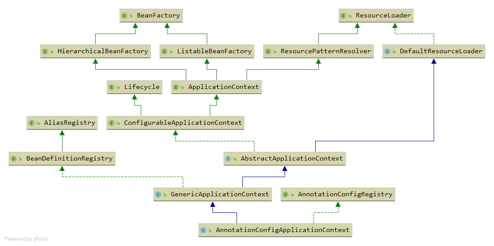

# Spring IOC 容器预启动流程源码探析

在应用程序中，一般是通过创建`ClassPathXmlApplicationContext`或`AnnotationConfigApplicationContext`这两个最底层子类来启动Spring IOC容器：

- `ClassPathXmlApplicationContext`: `xml`文件配置版
- `AnnotationConfigApplicationContext`: 注解版

由于当下越来越流行基于Java注解的配置来创建我们的`Bean`，所以本文主要以注解版进行探析。

## `AnnotationConfigApplicationContext`的类关系结构

我们先来看看我们探讨的起点

```java
public class Main {

	public static void main(String[] args) {
		new AnnotationConfigApplicationContext(Config.class);
	}
	@Configuration
	public static class Config{

	}
}
```

demo简简单单，那么，这里发生了什么？或许，我们可以先看看`AnnotationConfigApplicationContext`的类关系结构：



我们可以看到`AnnotationConfigApplicationContext`最上面有两个顶级接口：

- `BeanFactory`: Spring的核心接口，纯粹的bean容器，主要定义了与`Bean`的相关方法
- `ResourceLoader`：资源加载器，定义了`getResource`方法

继承自三个父类：

- `DefaultResourceLoader`: 默认的资源加载器，实现了三种加载资源的方式
  1. 通过`path`加载资源
  
  2. 通过`classpath`加载资源
  
  3. 通过`URL`加载资源
- `AbstractApplicationContext`: 实现了`ApplicationContext`接口的抽象类，主要功能
  1. 实现了启动IOC容器的核心方法：`refresh()`
  
  2. 发布事件
  
  3. 大量`getBean`相关的操作, 主要通过抽象方法`getBeanFactory`基于子类实现
  
  4. 大量留于子类扩展的空方法
  
  5. 消息国际化
- `GenericApplicationContext`: 
  
  1. 使用组合的方式引进了最底层的`BeanFactory`实现类：`DefaultListableBeanFactory`
  
  2. 定义了`registerBean`的相关操作，其实是通过`DefaultListableBeanFactory`实现的

> 不难发现，`ApplicationContext`名副其实，确实就是一个应用上下文，对于`bean`的相关操作，容器的管理，依旧是由我们的`BeanFactory`进行实现。

## 准备启动

### 1. 创建我们的实例：`AnnotationConfigApplicationContext`

```java
new AnnotationConfigApplicationContext(Config.class);
```

### 2.进入到`AnnotationConfigApplicationContext`构造方法

```java
public AnnotationConfigApplicationContext(Class<?>... annotatedClasses) {
    this();
    register(annotatedClasses);
    refresh();
}
```

### 3. 调用我们的空构造方法，这里要先实例化我们的父类

#### 3.1 实例化`DefaultResourceLoader`

```java
public DefaultResourceLoader() {
	this.classLoader = ClassUtils.getDefaultClassLoader();
}
```

`ClassUtils.getDefaultClassLoader()`主要有两步操作

```java
//获取线程上下文的类加载器
ClassLoader cl = = Thread.currentThread().getContextClassLoader();
if(cl == null) //为空则获取系统的类加载器 即为应用类加载器
    cl = ClassLoader.getSystemClassLoader();
```

> 这里我们非Tomcat环境，所以返回的是AppClassLoader

#### 3.2 实例化`AbstractApplicationContext`

```java
//为BeanFactoryPostProcessor赋初始值
List<BeanFactoryPostProcessor> BeanFactoryPostProcessor = new ArrayList<>();
public AbstractApplicationContext() {
    //引入一个资源解析器
    this.resourcePatternResolver = getResourcePatternResolver();
}
protected ResourcePatternResolver getResourcePatternResolver() {
    return new PathMatchingResourcePatternResolver(this);
}
```

#### 3.3 实例化`GenericApplicationContext`

```java
public GenericApplicationContext() {
    //引入BeanFactory实现
    this.beanFactory = new DefaultListableBeanFactory();
}
```

#### 3.4 实例化自己

```java
public AnnotationConfigApplicationContext() {
    //初始化基于注解的bean定义扫描器
    this.reader = new AnnotatedBeanDefinitionReader(this);
    //初始化基于classpath的bean定义扫描器
    this.scanner = new ClassPathBeanDefinitionScanner(this);
}
```

##### 3.4.1 `AnnotatedBeanDefinitionReader`初始化过程

```java
public AnnotatedBeanDefinitionReader(BeanDefinitionRegistry registry) {
    this(registry, getOrCreateEnvironment(registry));
}
public AnnotatedBeanDefinitionReader(BeanDefinitionRegistry registry, Environment environment) {
    //registry就是我们AnnotationConfigApplicationContext
    this.registry = registry;
    //引入条件表达式计算器 处理@Conditional注解
    this.conditionEvaluator = new ConditionEvaluator(registry, environment, null);
    //注册所有与注解相关的后置处理器
	AnnotationConfigUtils.registerAnnotationConfigProcessors(this.registry);
}
```

`AnnotationConfigUtils.registerAnnotationConfigProcessors(this.registry)`

```java
public static void registerAnnotationConfigProcessors(BeanDefinitionRegistry registry) {
	registerAnnotationConfigProcessors(registry, null);
}
```

`registerAnnotationConfigProcessors(registry, null)`中主要做了以下几件事情：

- 为`DefaultListableBeanFactory`赋值了两个引用

  ```java
  //依赖排序器，用于处理添加了Priority、Order注解以及实现了Ordered接口的bean
  beanFactory.setDependencyComparator(AnnotationAwareOrderComparator.INSTANCE);
  //@Autowire候选解析器
  beanFactory.setAutowireCandidateResolver(new ContextAnnotationAutowireCandidateResolver());
  ```

- 往容器中注册了6个后置处理器的bean定义

  注册配置类的后置处理器

  ```java
  RootBeanDefinition def = new RootBeanDefinition(ConfigurationClassPostProcessor.class);
  def.setSource(source);
  registerPostProcessor(registry, def, CONFIGURATION_ANNOTATION_PROCESSOR_BEAN_NAME);
  ```

  注册处理@Autowired注解的后置处理器

  ```java
  RootBeanDefinition def = new RootBeanDefinition(AutowiredAnnotationBeanPostProcessor.class);
  def.setSource(source);
  registerPostProcessor(registry, def, AUTOWIRED_ANNOTATION_PROCESSOR_BEAN_NAME);
  ```

  注册处理@Required注解的后置处理器(5.1版本开始已被废弃)

  ```java
  RootBeanDefinition def = new RootBeanDefinition(RequiredAnnotationBeanPostProcessor.class);
  def.setSource(source);
  registerPostProcessor(registry, def, REQUIRED_ANNOTATION_PROCESSOR_BEAN_NAME);
  ```

  注册处理JSR-250规范注解的后置处理器，@Resource,@PostConstruct,@PreDestroy

  ```java
  RootBeanDefinition def = new RootBeanDefinition(CommonAnnotationBeanPostProcessor.class);
  def.setSource(source);
  registerPostProcessor(registry, def, COMMON_ANNOTATION_PROCESSOR_BEAN_NAME);
  ```

  注册处理@EventListener注解的后置处理器

  ```java
  RootBeanDefinition def = new RootBeanDefinition(EventListenerMethodProcessor.class);
  def.setSource(source);
  registry, def, EVENT_LISTENER_PROCESSOR_BEAN_NAME);
  ```

  注册事件监听工厂，给上面的EventListenerMethodProcessors使用

  ```java
  RootBeanDefinition def = new RootBeanDefinition(DefaultEventListenerFactory.class);
  def.setSource(source);
  registerPostProcessor(registry, def, EVENT_LISTENER_FACTORY_BEAN_NAME);
  ```

##### 3.4.2 `ClassPathBeanDefinitionScanner`初始化过程

经历了一系列的构造器传递

```java
public ClassPathBeanDefinitionScanner(BeanDefinitionRegistry registry) {
    this(registry, true);
}

public ClassPathBeanDefinitionScanner(BeanDefinitionRegistry registry, boolean useDefaultFilters) {
    this(registry, useDefaultFilters, getOrCreateEnvironment(registry));
}

public ClassPathBeanDefinitionScanner(BeanDefinitionRegistry registry, boolean useDefaultFilters,
                                      Environment environment) {
    this(registry, useDefaultFilters, environment,
         (registry instanceof ResourceLoader ? (ResourceLoader) registry : null));
}
```

最终实现的构造器方法

```java
public ClassPathBeanDefinitionScanner(BeanDefinitionRegistry registry, boolean useDefaultFilters,
                                      Environment environment, @Nullable ResourceLoader resourceLoader) {

    Assert.notNull(registry, "BeanDefinitionRegistry must not be null");
    this.registry = registry;
	//默认为true
    if (useDefaultFilters) {
        //注册默认的过滤器
        registerDefaultFilters();
    }
    //设置环境
    setEnvironment(environment);
    //设置资源加载器
    setResourceLoader(resourceLoader);
}
```

 `registerDefaultFilters`方法

```java
protected void registerDefaultFilters() {
    //加入扫描@Component注解的过滤器，这样就能扫到@Controller,@Service...
    this.includeFilters.add(new AnnotationTypeFilter(Component.class));
    ClassLoader cl = ClassPathScanningCandidateComponentProvider.class.getClassLoader();
    try {
        //JSR-250规范的注解
        this.includeFilters.add(new AnnotationTypeFilter(
            ((Class<? extends Annotation>) ClassUtils.forName("javax.annotation.ManagedBean", cl)), false));
    }
    catch (ClassNotFoundException ex) {
    }
    try {
        //JSR-330规范的注解
        this.includeFilters.add(new AnnotationTypeFilter(
            ((Class<? extends Annotation>) ClassUtils.forName("javax.inject.Named", cl)), false));
    }
    catch (ClassNotFoundException ex) {
    }
}
```

### 4. 构造方法执行完毕，执行`register(annotatedClasses)`方法，将配置类的bean定义注册到容器中

```java
public void register(Class<?>... annotatedClasses) {
    Assert.notEmpty(annotatedClasses, "At least one annotated class must be specified");
    //这里就使用了刚刚初始化的AnnotatedBeanDefinitionReader扫码器
    //annotatedClasses即为在入口处传进的自定义配置类Config.class
    this.reader.register(annotatedClasses);
}
```

```java
public void register(Class<?>... annotatedClasses) {
    for (Class<?> annotatedClass : annotatedClasses) {
        //这里我们只传了一个，只有一次循环
        registerBean(annotatedClass);
    }
}
```

```java
public void registerBean(Class<?> annotatedClass) {
    //spring的特点，真正实现的都是do开头的方法
    doRegisterBean(annotatedClass, null, null, null);
}
```

```java
<T> void doRegisterBean(Class<T> annotatedClass, @Nullable Supplier<T> instanceSupplier, @Nullable String name,
                        @Nullable Class<? extends Annotation>[] qualifiers, BeanDefinitionCustomizer... definitionCustomizers) {
    //将class封装到bean定义中
    AnnotatedGenericBeanDefinition abd = new AnnotatedGenericBeanDefinition(annotatedClass);
    //由于配置类并未使用@Conditional注解，直接返回false
    if (this.conditionEvaluator.shouldSkip(abd.getMetadata())) {
        return;
    }

    abd.setInstanceSupplier(instanceSupplier);
    //解析bean定义的作用域
    ScopeMetadata scopeMetadata = this.scopeMetadataResolver.resolveScopeMetadata(abd);
    abd.setScope(scopeMetadata.getScopeName());
    String beanName = (name != null ? name : this.beanNameGenerator.generateBeanName(abd, this.registry));
    //处理普通的bean定义注解，@Lazy @Primary @DependsOn @Role @Description
    AnnotationConfigUtils.processCommonDefinitionAnnotations(abd);
    if (qualifiers != null) {
        for (Class<? extends Annotation> qualifier : qualifiers) {
            if (Primary.class == qualifier) {
                abd.setPrimary(true);
            }
            else if (Lazy.class == qualifier) {
                abd.setLazyInit(true);
            }
            else {
                abd.addQualifier(new AutowireCandidateQualifier(qualifier));
            }
        }
    }
    for (BeanDefinitionCustomizer customizer : definitionCustomizers) {
        customizer.customize(abd);
    }

    BeanDefinitionHolder definitionHolder = new BeanDefinitionHolder(abd, beanName);
    //根据scopeMetadata中的proxy-mode属性判断是否需要进行代理封装，默认否
    definitionHolder = AnnotationConfigUtils.applyScopedProxyMode(scopeMetadata, definitionHolder, this.registry);
    //将bean定义注册到容器中
    BeanDefinitionReaderUtils.registerBeanDefinition(definitionHolder, this.registry);
} 
```

> 前期准备工作已基本完毕，可以开始调用`refresh`方法启动IOC容器了。