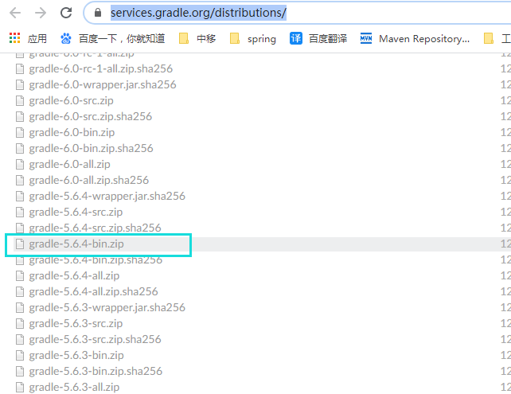

# Spring-Framework-5.2.x源码编译

## 编译环境

- JDK1.8.0_241
- IDEA2019.3.3
- gradle-5.6.4-bin

## 准备工作

- 源码下载： https://github.com/spring-projects/spring-framework

  选择版本，下载zip包，切记要选择RELEASE版本

  

  > 我这里选择的是5.2.8.RELEASE版本

- gradle下载： https://services.gradle.org/distributions/ 

  

  > 由于源码中使用的是5.6.4，所以我这里也选择的是5.6.4-bin版本

## 开始编译

### 解压zip包


### 修改配置

需要修改两处地方

- 打开gradle/wrapper/gradle-wrapper.properties

  

- 修改`distributionUrl`

  

  修改成之前下载的gradle-5.6.4-bin.zip路径，我放在D盘下，所以我的路径为

  

- 修改根目录下的`build.gradle`文件，修改maven私服地址

  ```groovy
  repositories {
      maven{ url 'https://maven.aliyun.com/nexus/content/groups/public/'}
      maven{ url 'https://maven.aliyun.com/nexus/content/repositories/jcenter'}
      mavenCentral()
      maven { url "https://repo.spring.io/libs-spring-framework-build" }
  }
  ```

### 开始编译

1. 编译compileTestJava模块

   打开源码所在文件夹，在windows cmd命令中输入

   ```shell
   gradlew :spring-oxm:compileTestJava
   ```

   > 显示BUILD SUCCESSFUL即可，不用管出现的git错误

2. 导入项目到idea

   File -> New -> Project from Existing Sources -> 选择spring源码中的build.gradle文件

   然后静静等待即可

## 创建模块测试

- new->model->gradle-->输入模块名称

- 在新的模块中的`build.gradle`文件添加依赖

  ```groovy
  dependencies {
      testCompile group: 'junit', name: 'junit', version: '4.12'
      compile(project(":spring-context"))
  }
  ```

- 编写测试代码测试

  ```java
  @Configuration
  public class QuickStart {
  
  	public static void main(String[] args) {
  		AnnotationConfigApplicationContext context = new AnnotationConfigApplicationContext(QuickStart.class);
  	}
  
  }
  ```

### 设置编译启动为idea方式

将红框部分修改如图所示


再次启动将报错


这是由于少了个kotlin包，将包添加到library中


重新build项目，Build -> Rebuild Project

此时会报找不到一大堆aop的符号，不用管，直接再次测试，发现控制台已是idea方式了。