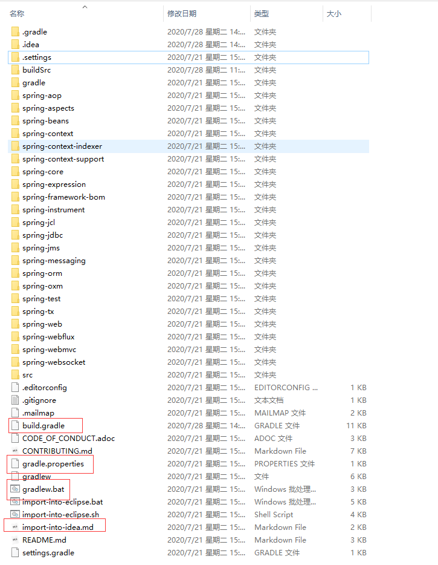
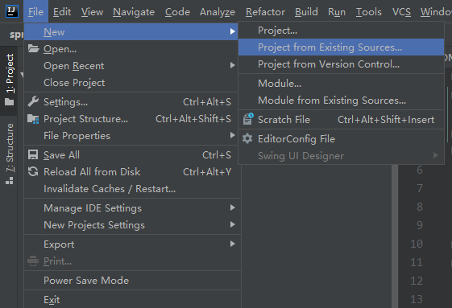
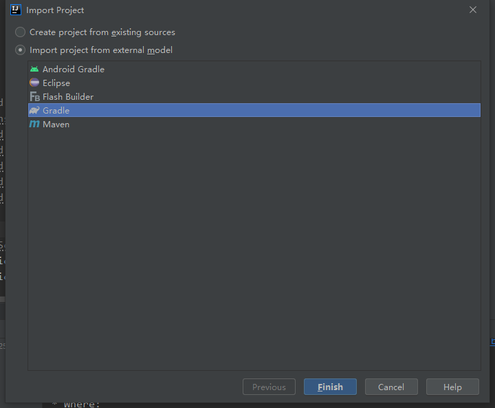
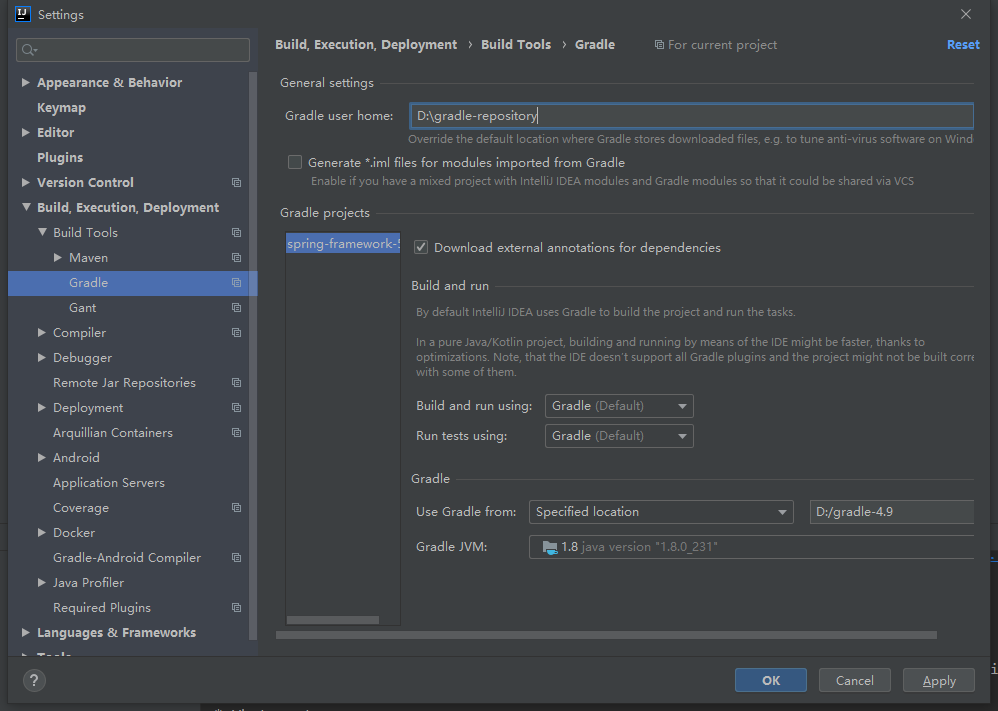
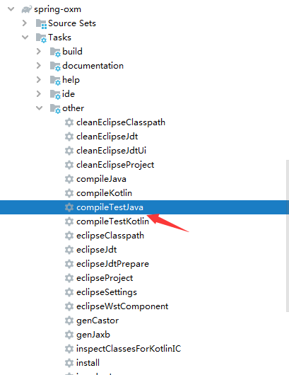
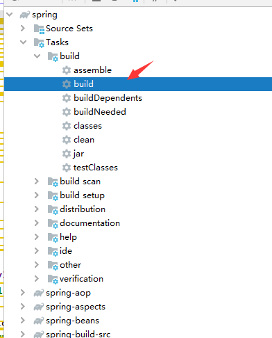
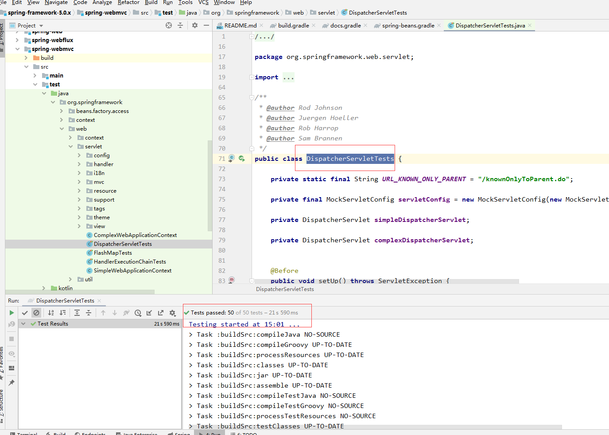
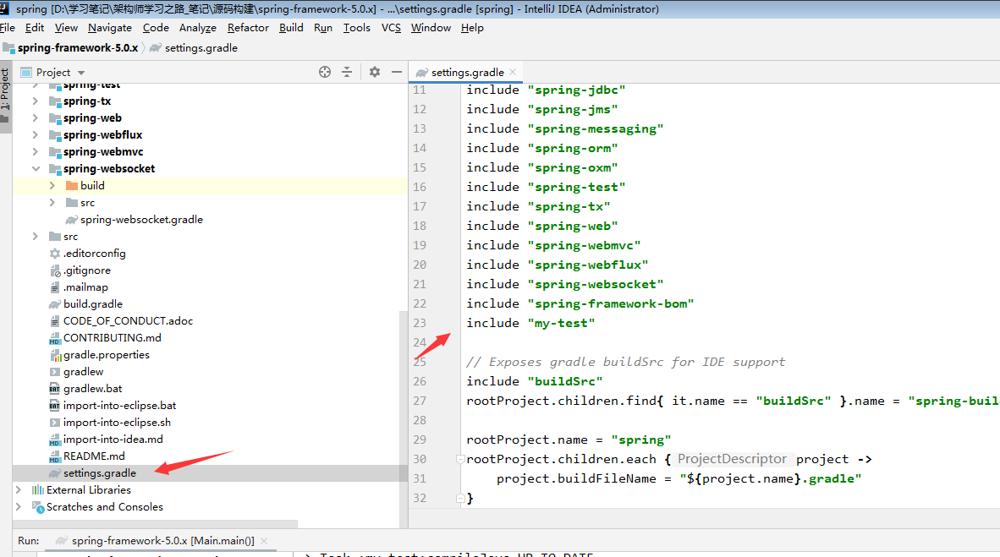

### 环境准备

- JDK 1.8
- GRADLE 4.9
  - 下载地址： https://services.gradle.org/distributions/
  -  配置教程：https://www.cnblogs.com/linkstar/p/7899191.html
- IDEA 随意，我这里是2020.1.2

### 下载源码

从github上下载源码， 我这里下载的是spring-framework-5.0.x

下载链接：https://github.com/spring-projects/spring-framework/archive/5.0.x.zip

下载较慢的话建议百度一个github文件加速下载

## 编译源码

### 解压



- build.gradle 放了一些依赖配置，有点像maven的pom文件 

- gradle.properties 存放当前Spring的版本，可以对比下看看是不是5.0.X版本 

- gradlew.bat 放的是项目的构建脚本，不过我是使用IDEA去构建 

- import-into-idea.md 这个是Spring导入IDEA的说明文件，可以根据里面的步骤去导入

### 将项目导入到IDEA



选择刚刚解压的目录打开，然后使用gradle方式导入



### 修改IDEA的gradle配置



> Gradle user home 为存放下载文件的位置
>
> Use Gradle from 选择我们自己刚刚配置好的gradle地址

### 开始构建

报错：spring-beans：

​					No such property: values for class: org.gradle.api.internal.tasks.DefaultTaskDependency

解决：修改spring-beans项目下的`spring-beans.gradle`文件

将最后三行替换为：

```groovy
//compileGroovy.dependsOn = compileGroovy.taskDependencies.values - "compileJava"
//compileKotlin.dependsOn(compileGroovy)
//compileKotlin.classpath += files(compileGroovy.destinationDir)
def deps = compileGroovy.taskDependencies.immutableValues + compileGroovy.taskDependencies.mutableValues
compileGroovy.dependsOn = deps - "compileJava"
compileKotlin.dependsOn(compileGroovy)
compileKotlin.classpath += files(compileGroovy.destinationDir)
```

重新构建

### 开始编译

预编译`spring-oxm`和 `spring-core`




两个项目都编译完成后，最终编译



等待漫长的世界，编译完成，我等了1小时3分钟

### 测试

这里我选择了`DispatcherServletTests`类进行测试



### 创建自己的模块


编辑`my-test.gradle`文件

```groovy
description = "My Test"

dependencies {
    compile(project(":spring-context"))
}
```

修改项目配置



刷新项目，尽情玩耍吧~